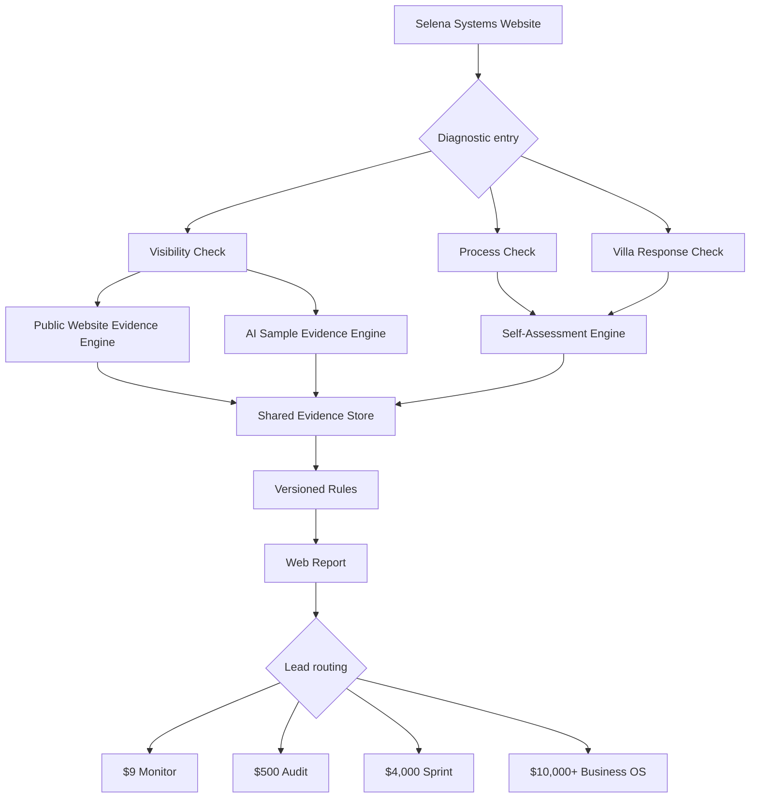
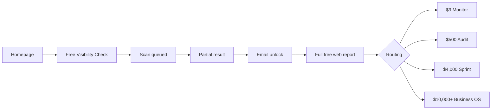
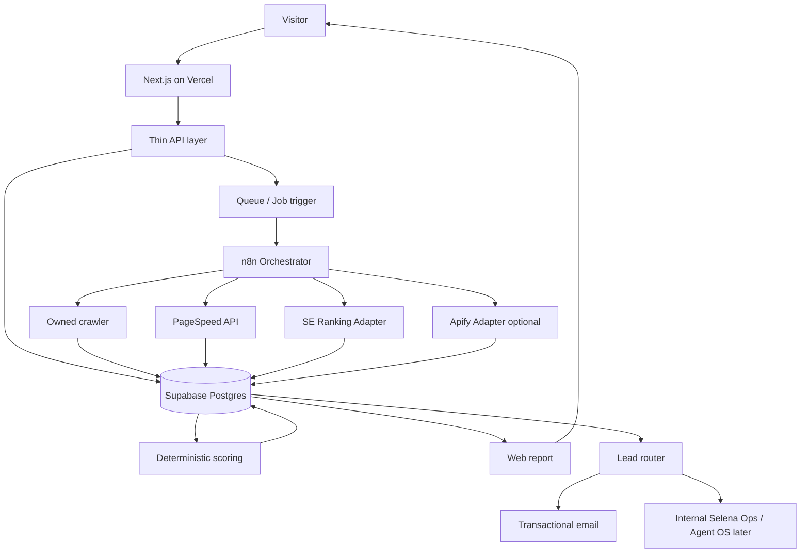

# SELENA SYSTEMS VISIBILITY PLATFORM
## Новая продуктовая архитектура, модель монетизации и исполнимое ТЗ для Codex

> **SUPERSEDED.** Активный SSOT — версия 1.2:
> `docs/architecture/SELENA_SYSTEMS_VISIBILITY_PLATFORM_ARCHITECTURE_AND_CODEX_TZ_V1_2.md`.
> V1.2 добавляет четыре слоя измерения (Discoverability / Understanding /
> Recommendation Evidence / Action Readiness), три состояния Action Readiness,
> Local Business Mode и годовой тариф Monitor `$90/год`.
> Этот файл сохранён как исторический артефакт. Разделы, которые V1.2 не
> отменяет, продолжают действовать — их реестр приведён в V1.2 §10;
> отменённое перечислено поимённо в V1.2 §9.

**Версия:** 1.1  
**Дата:** 30 июля 2026  
**Владелец продукта:** Selena  
**Канонический бренд:** Selena Systems  
**Production:** `https://www.selenasystems.com`  
**Целевой репозиторий:** `parkourcafe/SELENA-AI-COMPANY`  
**Наблюдавшаяся ветка:** `main`  
**Наблюдавшийся baseline commit:** `26714935190b408034674334337bbb35cc1fe12c`  
**Статус документа:** `APPROVED TARGET ARCHITECTURE / IMPLEMENTATION SSOT`  
**Путь в репозитории:** `docs/architecture/SELENA_SYSTEMS_VISIBILITY_PLATFORM_ARCHITECTURE_AND_CODEX_TZ_V1_1.md`

> Этот документ является единым источником правды для добавления Visibility-направления в Selena Systems. Он заменяет разрозненные идеи «GEO-сервис», «AI Health Check», «Business Health Score», отдельный AI Map и отдельный Villa Website Checker одной согласованной архитектурой.

> **Версия 1.1 отменяет тарифную модель версии 1.0**: базовый Monitor стоит `$9/мес.` и является полностью автоматическим. Яндекс, Topvisor и любые региональные поисковые интеграции исключены из обязательного ядра и roadmap. Русскоязычный интерфейс не означает обязательную поддержку Яндекса.

---

# 0. Правила доказательности

Во всём документе используются следующие статусы:

- **[ИЗВЛЕЧЕНО]** — прямо подтверждено текущим кодом, сайтом, репозиторием, официальной документацией провайдера или ранее утверждённым внутренним документом.
- **[ИНТЕРПРЕТИРОВАНО]** — архитектурный или продуктовый вывод из подтверждённых данных.
- **[РЕШЕНИЕ ВЛАДЕЛЬЦА]** — решение, которое должна окончательно утвердить Selena до соответствующего этапа.
- **`needs_verification`** — утверждение нельзя считать фактом до runtime-, API-, legal- или production-проверки.
- **[НЕ ДЕЛАТЬ]** — запрещённое решение.

## 0.1. Главный принцип продукта

```text
Raw evidence
→ deterministic checks
→ versioned metrics
→ plain-language explanation
→ human review for paid work
```

LLM может:

- классифицировать текст;
- объяснять найденные факты;
- группировать проблемы;
- готовить черновик рекомендации;
- помогать сформулировать отчёт.

LLM не может:

- придумывать измерения;
- назначать балл без зафиксированных правил;
- объявлять причинность без доказательств;
- рассчитывать потерянную выручку без данных клиента;
- выдавать один случайный ответ модели за объективное мнение рынка;
- называть generic API-ответ «тем, что показывает ChatGPT пользователям».

---

# 1. Исполнительное решение

## 1.1. Что строим

**[ИНТЕРПРЕТИРОВАНО / ТЕКУЩЕЕ РЕШЕНИЕ]**

Selena Systems остаётся публичным брендом, который проектирует и внедряет AI operating systems для бизнеса.

Внутри Selena Systems появляется продуктовая линия:

```text
SELENA SYSTEMS
│
├── Free Diagnostics
│   ├── Selena Visibility Check
│   └── Selena Process Check
│
├── Automated Monitoring
│   └── Monitor — $9/month
│
└── Human Implementation
    ├── AI Visibility Audit — $500
    ├── 7-Day Visibility Sprint — $4,000
    └── AI Business OS — from $10,000
```

**Visibility не является новым самостоятельным брендом.**  
**Visibility не получает отдельный домен.**  
**Visibility не заменяет основное позиционирование Selena Systems.**

Это диагностический и подписочный вход, который приводит клиентов в существующую лестницу внедрения.

## 1.2. Какую проблему решает каждый бесплатный вход

### Selena Visibility Check

Отвечает на внешний вопрос:

> Как публичный поиск и AI-системы находят, понимают и представляют этот бизнес?

Использует:

- публичные страницы сайта;
- технические сигналы;
- структуру бренда и предложения;
- ограниченную, явно маркированную выборку AI-ответов;
- доступные публичные источники;
- в платной версии — first-party данные владельца.

### Selena Process Check

Отвечает на внутренний вопрос:

> Какие процессы бизнес всё ещё выполняет вручную и что имеет смысл автоматизировать первым?

Использует:

- ответы владельца или команды;
- карту каналов;
- повторяемость операций;
- стоимость ручного труда только при наличии введённых данных;
- правила человеческого контроля;
- существующую логику AI Map как исходный материал.

## 1.3. Что не строим

**[НЕ ДЕЛАТЬ]**

- универсальный `Business Health Score`;
- один общий балл, смешивающий SEO, CRM, AI, продажи, репутацию и автоматизацию;
- отдельный GEO-бренд;
- отдельный третий сканер для Villa Ops;
- базовый автоматический Monitor за `$149` или другой агентский ценник;
- dashboard до проверки бесплатной воронки;
- ежедневный мониторинг в базовом тарифе;
- PDF-first продукт;
- расчёт «вы теряете $4,100 в месяц» без GA4, CRM, конверсии, среднего чека и модели атрибуции;
- утверждение «AI вас не рекомендует» на основании одной главной страницы;
- автоматическую публикацию исправлений на сайте клиента без отдельного разрешения;
- переписывание внутреннего Agent OS ради публичного Visibility MVP;
- вызов обычного LLM API с подписью «это результат ChatGPT Search».

---

# 2. Текущее состояние

## 2.1. Основной сайт Selena Systems

**[ИЗВЛЕЧЕНО]**

Текущий production-сайт:

- продаёт AI operating systems;
- использует позиционирование `Process first. Then the right tool.`;
- основной CTA ведёт на `Book AI Audit`;
- содержит три публичных пакета:
  - `AI Audit — $500`;
  - `AI Sprint — $4,000`;
  - `AI Business OS — from $10,000`;
- показывает пять собственных проектов:
  - KORA Food Hall;
  - PetID.care;
  - Doki.help;
  - remhaos.com;
  - otherbali.com.

Текущая кодовая база:

```text
Next.js 15.5.20
React 19.1
TypeScript 5.8
Tailwind CSS 4.1
Vercel
```

Основные подтверждённые файлы:

```text
app/page.tsx
app/en/contact/page.tsx
app/en/privacy/page.tsx
app/en/terms/page.tsx
components/landing/B2BHomeLanding.tsx
components/landing/RussianHomeLanding.tsx
lib/data/homepage.ts
lib/data/homepage-ru.ts
data/seo-control.json
docs/20-seo-top5-system.md
```

## 2.2. Существующий AI Map

**[ИЗВЛЕЧЕНО]**

Маршрут `/ru/ai-map` рендерит отдельный диагностический landing `RussianHomeLanding`, включающий:

- cinematic hero;
- time-loss calculator;
- goal selector;
- AI Map CTA;
- product ladder;
- service modules;
- implementation examples;
- founder story;
- trust boundaries;
- newsletter;
- FAQ;
- final CTA.

**[ИНТЕРПРЕТИРОВАНО]**

Это полезный контентный актив, но сейчас он:

- живёт в отдельной продуктовой логике;
- не является частью единого diagnostic core;
- не использует общий отчёт, lead identity, consent и routing;
- конкурирует за внимание с основной B2B-воронкой;
- должен быть преобразован в `Selena Process Check`, а не удалён.

## 2.3. Существующий Villa Response Readiness Funnel

**[ИЗВЛЕЧЕНО]**

В отдельном репозитории `parkourcafe/Bali-OS-VILLA-2026` уже существует:

- 90-секундный self-assessment;
- server-side canonical scoring;
- lead capture;
- результат с gate;
- disclaimer, что score является оценкой по ответам пользователя;
- отдельный `Instant Website Check`;
- PageSpeed;
- robots/sitemap/title/canonical/noindex проверки;
- JSON-LD, server-rendered text и contact checks;
- best-effort SSRF guard;
- unit tests.

## 2.4. Что в Villa Website Check надо сохранить

- публичные данные only;
- отсутствие логина и чтения private data;
- отказ от claims об индексации без Search Console;
- server-side source of truth;
- dependency injection для fetch и тестов;
- bounded response size;
- timeout;
- понятные pass/warn/fail/info states;
- graceful degradation при недоступности PageSpeed;
- один leadId и upsert, а не пачка дубликатов.

## 2.5. Что в Villa Website Check надо исправить

**[ИЗВЛЕЧЕНО]**

Текущая копия местами заявляет причинность сильнее, чем позволяет проверка. Например, отсутствие блокировки crawler трактуется как возможность AI «read and suggest» сайт, а наличие JSON-LD — как способность «quote details correctly».

**[ИНТЕРПРЕТИРОВАНО]**

Корректная формулировка:

```text
Crawler access is not visibly blocked.
```

а не:

```text
AI assistants can suggest your site.
```

И:

```text
Structured data is present and machine-readable.
```

а не:

```text
AI will quote your details correctly.
```

Сигнал готовности не равен факту видимости, рекомендации или цитирования.

## 2.6. Юридические страницы

**[ИЗВЛЕЧЕНО]**

Публичные English Terms и Privacy прямо называют себя draft и требуют legal review.

**[ИНТЕРПРЕТИРОВАНО]**

Это launch blocker для сбора email, хранения scan evidence, подписки, OAuth-интеграций и платёжных данных.

Codex не должен играть юриста. Он должен:

- зафиксировать реальные data flows;
- подготовить factual data inventory;
- добавить legal-review gate;
- не публиковать «финальную» политику без утверждения владельца и специалиста.

---

# 3. Целевая продуктовая архитектура

## 3.1. Один Diagnostic Platform, несколько evidence engines

Нужен не один гигантский score, а общий каркас:



Общее ядро:

- identity;
- lead;
- consent;
- report;
- evidence;
- issue taxonomy;
- CTA routing;
- analytics;
- provider cost;
- audit log;
- localization;
- entitlement later.

Раздельные evidence engines:

- public site scan;
- AI sample tracking;
- process self-assessment;
- Villa response self-assessment.

## 3.2. Основные пользователи

### Primary ICP

- владельцы бизнеса с работающей выручкой;
- founder-led service companies;
- hospitality;
- agencies;
- real estate and interiors;
- clinics и care businesses с legal/privacy boundaries;
- online businesses;
- компании, где лиды, документы, контент и операции ещё держатся на ручной работе.

### Secondary ICP

- маркетологи;
- SEO/GEO-специалисты;
- PR;
- content teams;
- владельцы нескольких брендов;
- небольшие агентства, которым нужен managed report.

### Не primary ICP первой версии

- массовые бесплатные пользователи без бизнеса;
- студенты;
- DIY SEO hobbyists;
- enterprise procurement с SSO/SLA;
- white-label агентства;
- пользователи, которым нужен только дешёвый rank tracker.

---

# 4. Продукты и монетизация

## 4.1. Бесплатно: Selena Visibility Check

### Ввод

Обязательные поля:

```text
Website
Brand name
Target market / country
Language
Business category
```

Опционально:

```text
One competitor
City / service area
Primary offer
```

Почему market и language обязательны:

- AI-ответы зависят от региона;
- результаты по английскому и русскому запросу неэквивалентны;
- локальная рекомендация в Bali не равна общей рекомендации в Indonesia;
- один домен может иметь несколько предложений.

### Бесплатный объём

```text
Up to 5 public pages
1 market
1 language
3 canonical commercial prompts
2 supported AI environments
Maximum 6 valid sampled answers
1 optional competitor sample
```

Публичные страницы выбираются в таком порядке:

1. homepage;
2. primary service/product page;
3. about;
4. contact;
5. FAQ или наиболее релевантная коммерческая страница.

Если страницы не найдены, это фиксируется как evidence.

### Что показывается до email

- `Public Readiness / 100`;
- `Entity Clarity / 100`;
- `AI Sample: mentioned in X of Y valid answers`;
- `Owned-domain citation sample: X of Y`;
- `Conversion Path: Clear / Partial / Weak / Not measured`;
- три наиболее значимых issues;
- sample size;
- confidence;
- `What we measured`;
- `What we did not measure`.

### Что открывается после email

- все бесплатные checks;
- полный список issues;
- evidence по каждому issue;
- все valid AI sample outcomes;
- один competitor comparison;
- limited citation/source map;
- `Critical / Important / Later`;
- персональная web-ссылка;
- одна бесплатная повторная проверка после установленного cooling period;
- CTA в подходящий продукт.

### Что бесплатно не отдаётся

- 25–100 tracked prompts;
- история;
- регулярные scans;
- 3–5 конкурентов;
- полный source opportunity map;
- multi-market;
- GSC/GA4 integrations;
- человеческая проверка;
- индивидуальная 90-day strategy;
- готовые тексты и технические fixes;
- внедрение;
- automatic task creation;
- unsupported revenue-loss estimate.

## 4.2. Бесплатно: Selena Process Check

Новый маршрут:

```text
/process-check
/ru/process-check
```

Результат:

```text
3 processes worth automating
1 process that should not be automated yet
Recommended first operating layer
Required human approvals
Implementation level
Recommended next product
```

Использует существующий AI Map как контентный и визуальный источник, но переносится на общую платформу:

- единая форма;
- единый lead;
- единый consent;
- единый report shell;
- единая event taxonomy;
- единая CTA-маршрутизация.

## 4.3. Vertical: Villa Response Check

Существующий Villa funnel остаётся специализированным входом, но не отдельной технологической системой.

Целевой deep link:

```text
/check?diagnostic=villa-response&market=ID-BA&language=en
```

или отдельная landing-поверхность:

```text
/industries/villa-operations/check
```

Общие компоненты:

- identity;
- lead capture;
- report;
- disclaimer;
- CTA routing;
- analytics;
- evidence store.

Отдельные компоненты:

- Villa question set;
- Villa scoring rules;
- Live Guest Inquiry Audit authorization;
- hospitality recommendations.

После functional parity старый host может получить 301, но только по отдельному owner gate.

## 4.4. Автоматическая подписка

Цена и границы продукта являются:

**[РЕШЕНИЕ ВЛАДЕЛЬЦА / FOUNDING PRICE]**

| План | Цена | Для кого | Entitlements |
|---|---:|---|---|
| Free Check | $0 | Разовая диагностика | 1 домен, 1 рынок, 3 prompts, 2 AI environments, без истории |
| Monitor | $9/мес. или $90/год | Малый бизнес и потенциальные клиенты Selena Systems | 1 домен, 1 рынок, 1 язык, 5 tracked prompts, 2 AI environments, 1 competitor, 1 scheduled run/month, 12 месяцев истории, automated monthly digest |

### Monitor — это не услуга человека

В тарифе $9 нет и не должно быть:

- human-reviewed memo;
- ручного исследования конкурентов;
- индивидуальной стратегии;
- onboarding call;
- ручной настройки prompt set;
- исправлений сайта;
- GSC/GA4 integrations;
- multi-market;
- priority support;
- обещанного роста видимости.

Monitor полностью автоматический:

```text
scheduled checks
→ normalized evidence
→ comparison with previous run
→ automated change summary
→ monthly email digest
```

Ручная работа начинается только с AI Visibility Audit — $500.

### Почему цена $9

- это low-friction продолжение бесплатного отчёта, а не замена зрелой enterprise GEO-платформе;
- основная коммерческая цель — удерживать связь с лидом и показывать динамику;
- глубокая маржа Selena Systems создаётся аудитом, спринтом и Business OS, а не базовым dashboard;
- тариф должен быть понятен владельцу малого бизнеса без отдельного бюджетного согласования.

### Экономические guardrails

До публичного checkout провести минимум 50 pilot runs и зафиксировать фактический COGS.

```text
Target total variable COGS: <= $3.50 / active paid project / month
Hard stop: > $5.00 / active paid project / month
```

Если hard stop нарушен:

1. не поднимать Monitor до агентской цены;
2. сначала уменьшить prompt/engine entitlement;
3. использовать batching/cache, где это не искажает evidence;
4. проверить другой provider contract;
5. при невозможности экономики не открывать paid Monitor.

### Частота

- Free Check — one-off;
- Monitor — один scheduled run в месяц;
- ручной re-run не входит в базовый тариф;
- weekly/daily tracking не входит в MVP и может появиться только как отдельный будущий профессиональный продукт после подтверждения спроса и экономики.

### Чего нет в публичном MVP

- Growth plan;
- Managed Visibility subscription;
- agency workspace;
- enterprise tracking;
- white-label;
- human-review subscription.

Эти продукты нельзя добавлять «на всякий случай». Для них требуется отдельное решение владельца после реальных данных использования Monitor.

## 4.5. Разовые платные продукты

### AI Visibility Audit — $500

Текущий AI Audit получает два selectable tracks:

```text
AI Systems Audit
AI Visibility Audit
```

AI Visibility Audit включает:

- human validation;
- 50–100 prompts, если provider budget подтверждён;
- несколько AI environments;
- 3–5 competitors;
- mention/citation/source map;
- technical readiness;
- entity consistency;
- content and answer-gap analysis;
- conversion path;
- 90-day prioritized plan;
- review call.

### 7-Day Visibility Sprint — $4,000

- fixes в crawl/indexability;
- entity and schema consistency;
- service page clarity;
- About/Contact/FAQ;
- direct-answer blocks;
- internal links;
- measurement setup;
- report/dashboard baseline;
- QA;
- handover.

### AI Business OS — from $10,000

Используется, когда Visibility Check выявляет более широкую проблему:

- lead intake fragmented;
- CRM absent;
- manual follow-up;
- content workflow absent;
- knowledge scattered;
- reports manual;
- no attribution;
- operations live in WhatsApp and human memory.

---

# 5. Воронка

## 5.1. Основная цепочка



## 5.2. Value before email

Email нельзя требовать до любого результата.

До email пользователь получает:

- факт, что scan завершён или частично завершён;
- category scores;
- sample counts;
- 3 issues;
- methodology disclosure.

После этого email открывает детали.

## 5.3. Consent

Транзакционное действие:

```text
Send me the report link
```

Маркетинговое согласие:

```text
Send me occasional Selena Systems insights and offers
```

Это два разных consent states.

Запрещено:

- автоматически включать marketing consent;
- скрывать его внутри Terms;
- считать delivery email согласием на рассылку.

## 5.4. Lead routing

### Route A: технически слабый сайт

Сигналы:

- blocked fetch/indexability;
- noindex;
- inconsistent canonical;
- missing key pages;
- unclear entity;
- broken conversion path.

CTA:

```text
Order AI Visibility Audit
Apply for Visibility Sprint
```

### Route B: сайт готов, но sampled mentions низкие

CTA:

```text
Start Monitor — $9/month
Order Visibility Audit
```

### Route C: видимость есть, conversion path слабый

CTA:

```text
Book AI Systems Audit
Build Lead Response System
```

### Route D: hospitality / villa

CTA:

```text
Run Villa Response Check
Book Villa Ops Audit
```

### Route E: слабая уверенность или provider partial failure

CTA:

```text
Rerun later
Request human-reviewed audit
```

Нельзя продавать уверенный fix, когда сама система пишет `not measured`.

---

# 6. Информационная архитектура

## 6.1. Принцип локалей

Сохранить текущую логику:

```text
/       → English
/ru     → Russian
```

Не проводить миграцию на обязательный `/en` в Phase 1. Это создаёт unnecessary redirect/canonical risk.

## 6.2. Целевые маршруты

| Route | Назначение | Phase |
|---|---|---:|
| `/` | Main EN landing | 0 |
| `/ru` | Main RU landing | 0 |
| `/visibility` | Product/method overview | 1 |
| `/ru/visibility` | RU product/method overview | 1 |
| `/check` | Visibility intake | 1 |
| `/ru/check` | RU visibility intake | 1 |
| `/report/[token]` | Shareable web report | 1 |
| `/process-check` | EN Process Check | 2 |
| `/ru/process-check` | RU Process Check | 2 |
| `/methodology` | Evidence and metric rules | 1 |
| `/ru/methodology` | RU methodology | 1 |
| `/pricing` | $9 monitoring + implementation | 1 |
| `/ru/pricing` | RU pricing | 1 |
| `/app` | Paid portal reserved | 3 |
| `/app/*` | Authenticated portal | 3 |
| `/api/checks` | Intake API | 1 |
| `/api/checks/[id]/status` | Job status | 1 |
| `/api/reports/[token]/summary` | Locked summary | 1 |
| `/api/reports/[token]/unlock` | Email unlock | 1 |
| `/api/reports/[token]` | Full report payload | 1 |
| `/api/webhooks/*` | Signed provider callbacks | 1 |

## 6.3. Redirects

После parity:

```text
/ru/ai-map → 301 /ru/process-check
```

До parity:

- старый маршрут остаётся live;
- никаких ранних 301 на пустую страницу;
- canonical остаётся согласованным с фактическим live route.

Villa domain redirect только после отдельного functional and SEO parity gate.

## 6.4. Новая навигация

Предлагаемая EN:

```text
Systems
Visibility
Sprint
Projects
Pricing
Free Check
```

Предлагаемая RU:

```text
Системы
Видимость
Спринт
Проекты
Цены
Бесплатная проверка
```

Primary CTA:

```text
Run Free Visibility Check
```

Secondary CTA:

```text
Book an AI Audit
```

## 6.5. Главный экран

Сохраняется исходное позиционирование:

```text
Build the AI operating system
your business keeps running manually.
```

Добавляется diagnostic entry:

```text
See how search and AI find, understand
and represent your business.

[ website.com                         ]
[ Target market ] [ Language ]
[ Run Free Check ]
```

Не использовать:

```text
What AI thinks about your business
```

AI не «думает» в человеческом смысле, а маркетинговая метафора быстро превращается в методологический долг.

## 6.6. Homepage sequence

```text
1. Existing operating-system hero
2. Free Visibility Check module
3. Problems
4. Systems
5. Visibility product explanation
6. 7-Day Sprint
7. Proof / own products
8. Track it yourself vs Have us fix it
9. Methodology / trust
10. Final CTA
```

Visibility усиливает основное предложение, а не оттесняет его.

---

# 7. Отчёт

## 7.1. Report header

```text
SELENA VISIBILITY REPORT

Domain: otherbali.com
Brand: Other Bali
Market: Indonesia / Bali
Language: English
Checked: 30 July 2026
Methodology: v1.0
Prompt set: commercial-core-v1
Sample: 6 valid AI answers
```

## 7.2. Summary

```text
PUBLIC READINESS
64 / 100

ENTITY CLARITY
71 / 100

AI SAMPLE
Mentioned in 2 of 6 valid answers

OWNED-DOMAIN CITATION SAMPLE
Cited in 1 of 6 valid answers

CONVERSION PATH
Partial
```

## 7.3. Обязательный trust block

```text
What we measured

• Publicly available pages
• Technical accessibility and indexability signals
• Structured identity and service clarity
• A limited, dated sample of AI responses
• Public links and citations returned by supported providers

What we did not measure

• Every possible prompt
• Every user location or personal context
• Private analytics
• CRM conversions
• Revenue impact
• Guaranteed future recommendations
• Causality between one website change and one AI answer
```

## 7.4. Issue card contract

Каждая карточка:

```text
Title
Severity
Status
Confidence

What we found
Evidence
Observed at
Why it matters
What this does NOT prove
Recommended action
Available Selena Systems path
```

Пример:

```text
Primary service definition is inconsistent

Evidence:
Homepage, metadata and Organization schema use
three materially different service descriptions.

Why it matters:
Machines and people receive conflicting definitions.

What this does NOT prove:
It does not prove that any AI engine will omit the brand.

Recommended action:
Create one canonical service definition and reuse it
across visible copy, metadata and structured data.
```

## 7.5. CTA block

```text
Track changes yourself
[ Start Monitor — $9/month ]

Need a verified plan?
[ Order $500 Audit ]

Want the issues fixed?
[ Apply for $4,000 Sprint ]
```

## 7.6. Web first

Primary report:

```text
https://www.selenasystems.com/report/<cryptographic-token>
```

PDF:

- optional export;
- generated only after web report;
- never the canonical result;
- includes report version and generated date;
- cannot expose private provider payload or email.

---

# 8. Методология измерения

## 8.1. Никакого одного общего score

MVP показывает две category scores и фактические AI counts:

```text
Public Readiness / 100
Entity Clarity / 100
Mentioned X / Y
Linked X / Y
Owned-domain cited X / Y
```

Не показывать:

```text
AI Visibility Score 78
```

пока нет:

- чёткой формулы;
- достаточной выборки;
- versioned prompt set;
- cross-engine normalization;
- стабильности;
- confidence model;
- доказанной интерпретируемости для клиента.

## 8.2. Public Readiness

Deterministic, versioned score.

Предлагаемая структура v1:

| Dimension | Weight |
|---|---:|
| Access and indexability signals | 30 |
| Machine-readable identity | 25 |
| Offer and page clarity | 25 |
| Conversion path | 20 |
| **Total** | **100** |

### Access and indexability signals

- homepage fetch;
- HTTP status;
- redirect chain;
- robots access;
- page-level noindex;
- X-Robots-Tag;
- canonical;
- sitemap discovery;
- mobile viewport;
- public server-rendered text availability.

### Machine-readable identity

- valid JSON-LD syntax;
- relevant Organization/LocalBusiness/Product/Service entity where applicable;
- name;
- URL;
- logo;
- sameAs;
- address/service area where relevant;
- consistent canonical brand;
- no material entity conflict.

### Offer and page clarity

- one clear H1;
- primary service or product;
- target customer;
- market/geography;
- About;
- Contact;
- service/product page;
- direct answers;
- supporting proof;
- unambiguous next step.

### Conversion path

- primary CTA;
- contact path;
- form or booking path;
- phone/WhatsApp/email where relevant;
- trust/legal links;
- mobile accessibility;
- no obvious broken action.

## 8.3. Score rule contract

Каждый rule имеет:

```json
{
  "id": "indexability.noindex",
  "version": 1,
  "dimension": "access",
  "weight": 8,
  "evidence_required": ["html_meta", "x_robots_tag"],
  "states": {
    "pass": 1,
    "warn": 0.5,
    "fail": 0,
    "not_measured": null
  }
}
```

Правила:

- `not_measured` не считается как fail;
- denominator пересчитывается только по measured checks;
- отчёт показывает coverage;
- если coverage ниже threshold, score маркируется `low confidence`;
- score config хранится отдельно от UI;
- изменение weight создаёт новую `scoring_version`.

## 8.4. Entity Clarity

Пять измерений:

| Dimension | Max |
|---|---:|
| Identity: кто это | 20 |
| Offer: что продаёт | 20 |
| Audience: кому | 20 |
| Geography / market | 20 |
| Proof and consistency | 20 |

LLM может извлечь candidate statements, но score рассчитывает deterministic evaluator по schema:

```json
{
  "brand_name": {
    "value": "Selena Systems",
    "sources": ["/", "/about", "jsonld"],
    "consistency": "consistent"
  }
}
```

Если LLM не уверен:

```text
unknown
```

а не красивое предположение.

## 8.5. AI Sample

### Canonical prompt classes

1. Discovery:
   ```text
   What are the best [category] providers for [need] in [market]?
   ```

2. Comparison:
   ```text
   Compare reliable options for [need] in [market].
   ```

3. Recommendation:
   ```text
   Which [category] would you recommend for [ICP/problem] in [market]?
   ```

Правила:

- brand name не вставляется в каждый prompt;
- иначе measurement превращается в подсказку модели;
- query language соответствует выбранному language;
- market and category фиксируются;
- exact prompt хранится;
- template version хранится;
- competitor не должен автоматически попадать во все prompts;
- prompts проходят preview/validation.

### Метрики

```text
valid_answer_count
brand_mention_count
brand_link_count
owned_domain_citation_count
recommendation_count
competitor_mention_count
```

Формулы:

```text
mention_rate = brand_mention_count / valid_answer_count
link_rate = brand_link_count / valid_answer_count
owned_citation_rate = owned_domain_citation_count / valid_answer_count
```

Если `valid_answer_count = 0`:

```text
Not measured
```

а не `0% visibility`.

## 8.6. Confidence

```text
LOW
- fewer than 4 valid answers; or
- one provider only; or
- partial provider failure.

MEDIUM
- 4–6 valid answers;
- at least two distinct environments;
- evidence payload available.

HIGH
- reserved for paid monitoring with repeated dates,
  stable prompt set and sufficient sample.
```

Free Check не должен обещать `HIGH` после шести ответов.

## 8.7. Provider naming honesty

Запрещено называть generic model response:

```text
ChatGPT result
Gemini search result
Claude recommendation
```

если provider фактически:

- вызывает API-модель без web search;
- не воспроизводит consumer interface;
- не документирует environment.

Использовать:

```text
ChatGPT tracked environment via SE Ranking
Google AI Overview sample
Perplexity tracked response
```

## 8.8. `llms.txt`

`llms.txt`:

- проверяется как informational housekeeping;
- имеет score weight `0` в MVP;
- отсутствие не является проблемой;
- наличие не считается доказательством citation eligibility;
- отчёт маркирует его как proposed/unproven convention;
- не заменяет robots, sitemap, structured data и ясный контент.

## 8.9. Structured data

Schema:

- проверяется на syntax и entity consistency;
- не получает claim «повысит AI visibility»;
- не получает claim «AI будет цитировать правильно»;
- используется как machine-readable corroboration;
- rich result eligibility не равна AI recommendation.

---

# 9. Источники данных и роль инструментов

## 9.1. Provider matrix

| Layer | Primary | Secondary / later | Не использовать как замену |
|---|---|---|---|
| Public crawl | Owned crawler | Apify Actor | LLM guess |
| Performance | Google PageSpeed API | CrUX later | browser screenshot only |
| AI tracked answers | SE Ranking AIRT | Apify or another separately approved provider | generic LLM API |
| Sources/citations | SE Ranking Sources/answer evidence | Apify Google AI capture | invented source list |
| Search first-party | Google Search Console | additional connector only after separate owner decision | public rank estimate |
| Behavior | GA4 / first-party analytics | additional client analytics connector later | traffic guess |
| Storage | Supabase Postgres/Storage | — | n8n execution history |
| Orchestration | n8n + queue | Supabase Edge Functions | one long browser request |
| Scheduling | Supabase Cron/Queue | Vercel Cron trigger | cron as reliable queue |
| Internal operations | Selena Agent OS later | — | public app dependency |

## 9.2. SE Ranking

**[ИЗВЛЕЧЕНО ИЗ ОФИЦИАЛЬНОЙ ДОКУМЕНТАЦИИ]**

AI Results Tracker API поддерживает:

- ChatGPT;
- Perplexity;
- Gemini;
- Google AI Overview;
- Google AI Mode;
- brands;
- prompts;
- rankings;
- full answer evidence;
- source URLs;
- detected brand mentions;
- competitor/source analysis.

Архитектурное решение:

- SE Ranking является primary provider candidate;
- provider adapter обязателен;
- API response никогда не пишется напрямую в UI;
- retain provider IDs;
- store provider retrieval date;
- respect text retention limits;
- do not expose full raw answer publicly unless provider terms allow.

## 9.3. Региональные провайдеры — вне обязательного scope

**[РЕШЕНИЕ ВЛАДЕЛЬЦА]**

MVP и базовый Monitor не требуют:

- Яндекс;
- Yandex Webmaster;
- Yandex Metrica;
- Alice AI;
- любого другого регионального search/AI provider.

Русскоязычный интерфейс является локализацией Selena Systems, а не обещанием поддержки российских поисковых систем.

Архитектура сохраняет общий provider adapter, поэтому отдельный региональный connector можно добавить позже, только если:

1. существует конкретный платящий рынок или клиент;
2. подтверждена официальная API capability;
3. измерена стоимость;
4. owner отдельно утвердил scope и public claim.

Ни один региональный provider не входит в roadmap V1.1.

## 9.4. Apify

Использовать:

- public crawling;
- specific Google AI Overview/AI Mode capture;
- provider fallback;
- batch URL discovery;
- queueable background jobs.

Правила:

- pin Actor/version;
- validate output schema;
- store Actor run ID;
- set timeout and cost cap;
- do not depend on an unversioned community Actor as the only source;
- no CAPTCHA bypass;
- no login bypass;
- no private data;
- verify terms and geographical legality.

## 9.5. Google Search Console

Только после OAuth и подтверждения ownership:

- search analytics;
- query/page/country/device;
- verified properties;
- sitemaps.

Не использовать GSC в anonymous Free Check.

## 9.6. PageSpeed

Использовать:

- mobile and desktop lab data;
- Lighthouse categories;
- performance evidence;
- selected actionable audits.

Не превращать нестабильный single-run score в главный Selena score.

## 9.7. n8n

n8n:

- оркестрирует;
- запускает provider jobs;
- нормализует callbacks;
- отправляет delivery email;
- делает lead routing;
- создаёт internal alerts.

n8n не является:

- system of record;
- единственным местом scoring logic;
- единственным местом secrets;
- клиентским dashboard;
- источником истины по статусу scan.

## 9.8. Supabase

Supabase хранит:

- users later;
- leads;
- sites;
- scans;
- evidence;
- reports;
- Monitor subscription later;
- event log;
- provider usage.

Queues/Cron могут использоваться для:

- retryable jobs;
- recurring scans;
- dead-letter workflow;
- scheduled reruns.

## 9.9. Vercel

Vercel используется для:

- Next.js UI;
- thin API;
- authentication boundary;
- signed webhooks;
- report serving;
- cron trigger where suitable.

Не помещать весь crawl + PageSpeed + 6 AI calls + scoring в один synchronous request.

---

# 10. Техническая архитектура

## 10.1. Решение по репозиторию

Phase 0–2 реализуются в текущем:

```text
parkourcafe/SELENA-AI-COMPANY
```

Не проводить monorepo migration до появления реальной необходимости.

Причины:

- текущий сайт небольшой;
- одна design system;
- общие locale/content contracts;
- MVP не требует отдельной deploy topology;
- migration создаст риск и не добавит клиентской ценности.

## 10.2. Agent OS

`Aether-Medium` / `os.selenasystems.com` остаётся отдельной internal platform.

В Phase 1:

- public Visibility не зависит от Agent OS;
- Agent OS не хранит canonical scan state;
- не требуется его переделывать;
- можно отправлять qualified lead/internal task через signed webhook позже.

## 10.3. Компоненты



## 10.4. Proposed repository structure

Не ломать существующую структуру. Добавить:

```text
app/
  check/
    page.tsx
  visibility/
    page.tsx
  methodology/
    page.tsx
  pricing/
    page.tsx
  report/
    [token]/
      page.tsx
  ru/
    check/
      page.tsx
    visibility/
      page.tsx
    methodology/
      page.tsx
    pricing/
      page.tsx
    process-check/
      page.tsx
  api/
    checks/
      route.ts
      [id]/
        status/
          route.ts
    reports/
      [token]/
        route.ts
        summary/
          route.ts
        unlock/
          route.ts
    webhooks/
      n8n/
        route.ts
      apify/
        route.ts
      provider/
        route.ts

components/
  visibility/
    CheckForm.tsx
    ScanProgress.tsx
    ScoreCard.tsx
    MetricCount.tsx
    EvidenceCard.tsx
    IssueCard.tsx
    MethodologyDisclosure.tsx
    ReportCTA.tsx
    ReportUnlock.tsx
  process-check/
  shared-diagnostics/

lib/
  diagnostics/
    contracts/
    validators/
    evidence/
    issues/
    reports/
    routing/
    analytics/
  visibility/
    crawler/
    discovery/
    checks/
    scoring/
    prompts/
    normalization/
    providers/
      seranking.ts
      apify.ts
      pagespeed.ts
      mock.ts
    security/
      url-safety.ts
      signatures.ts
      rate-limit.ts
  supabase/
    server.ts
    browser.ts
    types.ts

data/
  visibility/
    check-catalog.v1.json
    scoring.v1.json
    prompt-templates.v1.json
    issue-copy.en.v1.json
    issue-copy.ru.v1.json

supabase/
  migrations/
  seed.sql

automation/
  n8n/
    README.md
    workflow-specs/
    exports/

docs/
  architecture/
  audits/
  methodology/
  runbooks/
  decisions/

tests/
  unit/
  integration/
  e2e/
```

## 10.5. Provider adapters

Общий interface:

```ts
export interface AiEvidenceProvider {
  key: string;
  capabilities: {
    webGrounded: boolean;
    citations: boolean;
    competitors: boolean;
    historical: boolean;
  };

  runPrompt(input: RunPromptInput): Promise<ProviderPromptResult>;
  getRunStatus?(id: string): Promise<ProviderRunStatus>;
}
```

UI не должен знать provider-specific fields.

## 10.6. Feature flags

```text
VISIBILITY_CHECK_ENABLED
VISIBILITY_LIVE_CRAWLER_ENABLED
VISIBILITY_PAGESPEED_ENABLED
VISIBILITY_AI_SAMPLE_ENABLED
VISIBILITY_SERANKING_ENABLED
VISIBILITY_APIFY_ENABLED
VISIBILITY_EMAIL_UNLOCK_ENABLED
VISIBILITY_PAID_PLANS_ENABLED
VISIBILITY_GSC_OAUTH_ENABLED
```

Каждый внешний provider можно выключить без падения всего report.

---

# 11. Async job model

## 11.1. Scan state machine

```text
created
→ queued
→ discovering
→ crawling
→ technical_analysis
→ ai_sampling
→ scoring
→ report_ready
```

Дополнительные terminal/partial states:

```text
partial
failed
cancelled
expired
```

## 11.2. Правила

- intake API отвечает быстро;
- тяжёлая работа асинхронна;
- UI polling использует bounded interval;
- duplicate submit использует idempotency;
- provider failure не уничтожает уже собранное evidence;
- report может быть `partial`;
- missing section пишет `not measured`;
- user sees stage, not fake progress percentage;
- retry policy versioned;
- dead-letter alert exists.

## 11.3. n8n workflows

### `SELENA_VIS_01_INTAKE`

- receive signed job;
- validate run ID;
- claim job;
- set status;
- invoke discovery.

### `SELENA_VIS_02_DISCOVER_AND_CRAWL`

- normalize URL;
- DNS/IP safety;
- homepage fetch;
- discover candidate pages;
- fetch max five pages;
- store evidence;
- trigger PageSpeed in parallel.

### `SELENA_VIS_03_AI_SAMPLE`

- load canonical prompt set;
- create provider runs;
- enforce budget;
- collect valid results;
- store provider refs;
- normalize mentions/citations;
- mark partial failures.

### `SELENA_VIS_04_SCORE_AND_BUILD_REPORT`

- load versioned scoring config;
- calculate measured coverage;
- create issues;
- generate plain-language explanation;
- validate explanation against evidence IDs;
- persist report.

### `SELENA_VIS_05_DELIVERY_AND_ROUTING`

- publish partial summary;
- process email unlock;
- send transactional email;
- calculate lead route;
- notify internal channel for qualified lead.

### `SELENA_VIS_06_RERUN`

- enforce entitlement/cooling period;
- reuse unchanged crawl where allowed;
- rerun AI samples;
- compare with previous run;
- store delta.

### `SELENA_VIS_07_FAILURE_ALERT`

- dead-letter;
- provider outage;
- cost circuit breaker;
- webhook signature failure;
- repeated SSRF attempt;
- report generation failure.

---

# 12. Data model

## 12.1. MVP tables

### `leads`

```text
id uuid pk
email citext nullable
name text nullable
company text nullable
marketing_opt_in boolean default false
marketing_consent_version text nullable
transactional_consent_at timestamptz nullable
source text
created_at timestamptz
updated_at timestamptz
```

### `sites`

```text
id uuid pk
submitted_url text
normalized_url text
registrable_domain text
final_url text nullable
brand_name text
business_category text
market_code text
language_code text
created_at timestamptz
updated_at timestamptz
unique(normalized_url, market_code, language_code, brand_name)
```

### `diagnostic_runs`

```text
id uuid pk
site_id uuid fk
lead_id uuid nullable fk
diagnostic_type text
public_token_hash text
status text
stage text
methodology_version text
scoring_version text
prompt_set_version text
requested_at timestamptz
started_at timestamptz nullable
completed_at timestamptz nullable
expires_at timestamptz nullable
coverage numeric nullable
confidence text nullable
error_code text nullable
error_summary text nullable
idempotency_key text nullable
```

### `scan_pages`

```text
id uuid pk
run_id uuid fk
requested_url text
final_url text nullable
status_code integer nullable
content_type text nullable
bytes_read integer nullable
fetched_at timestamptz nullable
title text nullable
canonical_url text nullable
robots_meta text nullable
x_robots_tag text nullable
text_length integer nullable
html_hash text nullable
raw_storage_ref text nullable
fetch_error_code text nullable
```

### `scan_checks`

```text
id uuid pk
run_id uuid fk
page_id uuid nullable fk
rule_id text
rule_version integer
dimension text
state text
score_fraction numeric nullable
weight numeric
confidence text
observed_value jsonb
evidence jsonb
source_url text nullable
observed_at timestamptz
```

### `ai_prompt_runs`

```text
id uuid pk
run_id uuid fk
provider_key text
engine_key text
environment_label text
web_grounded boolean
prompt_template_id text
prompt_text text
market_code text
language_code text
status text
provider_run_id text nullable
provider_prompt_id text nullable
run_date date
valid boolean
error_code text nullable
raw_private_ref text nullable
answer_hash text nullable
```

### `ai_observations`

```text
id uuid pk
prompt_run_id uuid fk
brand_mentioned boolean nullable
brand_linked boolean nullable
owned_domain_cited boolean nullable
recommended boolean nullable
mention_position integer nullable
sentiment text nullable
competitor_mentions jsonb
evidence_excerpt text nullable
confidence text
```

### `ai_citations`

```text
id uuid pk
prompt_run_id uuid fk
url text
domain text
title text nullable
source_position integer nullable
owned_domain boolean
observed_at timestamptz
```

### `issues`

```text
id uuid pk
run_id uuid fk
rule_id text
category text
severity text
status text
title_key text
evidence_ids uuid[]
confidence text
recommended_action_key text
display_order integer
created_at timestamptz
```

### `reports`

```text
id uuid pk
run_id uuid fk unique
summary_json jsonb
full_json jsonb
generated_at timestamptz
unlocked_at timestamptz nullable
locale text
report_version text
```

### `provider_usage`

```text
id uuid pk
run_id uuid fk
provider_key text
operation text
units numeric nullable
estimated_cost numeric nullable
currency text nullable
latency_ms integer nullable
status text
created_at timestamptz
```

### `diagnostic_events`

```text
id uuid pk
run_id uuid nullable fk
lead_id uuid nullable fk
event_name text
properties jsonb
consent_class text
created_at timestamptz
```

## 12.2. Phase 3 tables

```text
organizations
organization_members
projects
subscriptions
subscription_entitlements
tracked_prompts
prompt_groups
competitors
scheduled_runs
integration_connections
oauth_tokens_encrypted
human_reviews
implementation_tasks
audit_log
```

## 12.3. Data rules

- raw provider payload private;
- public report uses normalized evidence only;
- email never embedded in report URL;
- public token stores hash, not plaintext;
- provider key never reaches browser;
- service role server only;
- all timestamps UTC;
- market/language explicit;
- every evidence item has observed date;
- dynamic claim has freshness;
- missing is not zero;
- raw HTML retention configurable;
- deletion can remove lead identity without corrupting aggregate product analytics.

---

# 13. API contracts

## 13.1. Create check

```http
POST /api/checks
Idempotency-Key: <uuid>
Content-Type: application/json
```

Request:

```json
{
  "website": "https://example.com",
  "brandName": "Example",
  "market": "ID-BA",
  "language": "en",
  "category": "villa management",
  "competitor": "competitor.example",
  "diagnosticType": "visibility"
}
```

Response:

```json
{
  "checkId": "uuid",
  "status": "queued",
  "statusUrl": "/api/checks/uuid/status",
  "reportPath": "/report/public-token",
  "methodologyVersion": "visibility-v1.0"
}
```

## 13.2. Status

```http
GET /api/checks/:id/status
```

Response:

```json
{
  "status": "ai_sampling",
  "completedStages": ["discovery", "crawl", "technical_analysis"],
  "availableSections": ["public_readiness", "entity_clarity"],
  "partial": true
}
```

Не возвращать выдуманный:

```json
{ "progress": 87 }
```

если система не имеет реальной progress model.

## 13.3. Summary

```http
GET /api/reports/:token/summary
```

Возвращает только ungated value.

## 13.4. Unlock

```http
POST /api/reports/:token/unlock
```

Request:

```json
{
  "email": "owner@example.com",
  "marketingOptIn": false,
  "consentVersion": "report-delivery-v1"
}
```

Rules:

- idempotent;
- email validation;
- rate limit;
- transactional delivery separated;
- same lead updates rather than duplicates.

## 13.5. Signed webhook

```http
POST /api/webhooks/n8n
X-Selena-Timestamp: ...
X-Selena-Signature: ...
```

Signature:

```text
HMAC_SHA256(secret, timestamp + "." + raw_body)
```

Reject:

- stale timestamp;
- signature mismatch;
- unknown run;
- invalid state transition;
- oversized payload;
- replay.

## 13.6. Stable error codes

```text
INVALID_URL
BLOCKED_HOST
DNS_REBINDING_RISK
UNSUPPORTED_CONTENT_TYPE
FETCH_TIMEOUT
FETCH_TOO_LARGE
ROBOTS_DENIED
PAGESPEED_UNAVAILABLE
PROVIDER_UNAVAILABLE
PROVIDER_BUDGET_EXCEEDED
INSUFFICIENT_VALID_AI_SAMPLE
REPORT_NOT_READY
TOKEN_INVALID
RATE_LIMITED
CONSENT_REQUIRED
INTERNAL_ERROR
```

UI translates codes; it does not parse arbitrary error messages.

---

# 14. Crawl and security

## 14.1. URL safety

Existing Villa checker provides a useful baseline, but production MVP needs stronger SSRF protection.

Required:

- `http` and `https` parsing, preferably upgrade to HTTPS;
- DNS resolve before request;
- reject IPv4/IPv6 private, loopback, link-local, multicast, reserved;
- reject cloud metadata hosts;
- re-resolve and revalidate every redirect;
- limit redirect count;
- protect against DNS rebinding;
- allowed ports;
- content-type allowlist;
- max bytes;
- connect/read timeout;
- no credentials in URL;
- no `file:`, `ftp:`, `data:`, `gopher:`;
- public host only;
- safe user-agent;
- bounded concurrency;
- per-domain rate limit.

## 14.2. Crawl scope

Free:

```text
max 5 pages
max 2 MB per HTML page
max 1 sitemap fetch
max bounded sitemap entries read
no form submit
no authentication
no JS browser by default
```

Browser rendering can be fallback only when:

- raw HTML is clearly empty;
- budget allows;
- report labels rendered evidence;
- browser task remains sandboxed.

## 14.3. Robots

- respect standard crawl controls;
- record exact reason;
- distinguish robots crawl block from `noindex`;
- do not claim index status from robots alone;
- do not bypass WAF;
- allow client to request a human audit if bot protection blocks scan.

## 14.4. Abuse prevention

- IP hash with rotating salt;
- per-IP and per-domain caps;
- repeated-domain caching;
- provider budget cap;
- CAPTCHA only when abuse threshold crossed;
- deny bulk anonymous API usage;
- circuit breaker;
- no endpoint exposing arbitrary server fetch.

## 14.5. Report access

Free report:

- cryptographically random token;
- no sequential IDs;
- optional expiration;
- no PII in URL;
- robots `noindex, nofollow`;
- excluded from sitemap;
- `Cache-Control` appropriate to sensitivity;
- revoke token capability.

Paid portal later:

- auth;
- organization membership;
- RLS;
- audit log.

---

# 15. Privacy, legal and content boundaries

## 15.1. Anonymous check data

Collect only:

- submitted public URL;
- brand and business context entered;
- scan evidence;
- salted abuse-prevention signal;
- technical event data with consent class.

Do not collect:

- passwords;
- private dashboards;
- hidden CRM data;
- cookies from target site;
- form submissions to target site;
- personal data scraped from arbitrary pages beyond what is necessary for public contact-path detection.

## 15.2. Email unlock

Need factual Privacy page covering:

- data controller/legal entity;
- purpose;
- data categories;
- providers;
- retention;
- report link;
- analytics;
- marketing consent;
- deletion/correction contact;
- cross-border processing where applicable.

**[РЕШЕНИЕ ВЛАДЕЛЬЦА]**

- legal entity;
- applicable jurisdiction;
- retention;
- privacy contact;
- email provider;
- analytics provider;
- payment provider.

## 15.3. Provider answer content

До подтверждения provider terms:

- raw full answers private;
- public report uses short evidence excerpts;
- source URLs;
- normalized observations;
- hashes;
- dates;
- no bulk republication.

## 15.4. Claims rules

Запрещённые формулировки:

```text
This will make ChatGPT recommend you.
AI cannot see your business.
You are losing $X every month.
Schema guarantees citations.
llms.txt improves rankings.
We measure every AI answer.
```

Допустимые:

```text
We did not detect the brand in this dated sample.
Crawler access was not visibly blocked.
The site has inconsistent entity information.
This sample is limited to the listed prompts and environments.
The change may improve machine readability; it does not guarantee recommendations.
```

---

# 16. Analytics

## 16.1. Event taxonomy

```text
visibility_landing_viewed
check_started
check_submitted
scan_queued
scan_stage_changed
scan_partial_ready
scan_ready
scan_failed
partial_report_viewed
email_unlock_viewed
email_unlock_submitted
full_report_viewed
issue_opened
methodology_opened
report_shared
rerun_requested
monitor_cta_clicked
audit_cta_clicked
sprint_cta_clicked
business_os_cta_clicked
booking_started
booking_completed
```

## 16.2. Funnel KPIs

```text
Landing → check start
Check start → submit
Submit → partial report
Partial report → email unlock
Unlock → full report view
Full report → CTA click
CTA click → booked call
Booked call → paid audit
Paid audit → sprint
Sprint → recurring plan / Business OS
```

## 16.3. Quality KPIs

- successful scans;
- partial scans;
- provider failure rate;
- median scan duration;
- evidence coverage;
- AI valid-answer rate;
- report open rate;
- issue expansion rate;
- human-audit disagreement rate;
- duplicate lead rate;
- abuse rate;
- cost per free completed report;
- cost per qualified lead;
- gross margin by plan.

## 16.4. Unit economics

Не придумывать число заранее.

```text
C_free =
  C_crawl
+ C_pagespeed
+ C_ai_provider
+ C_storage
+ C_email
+ C_orchestration
+ expected_support_cost
```

После не менее 50 внутренних/pilot runs определить:

- average;
- p95;
- provider failure;
- cache savings;
- free-to-paid conversion;
- acceptable free budget.

---

# 17. UI and design

## 17.1. Design continuity

Использовать текущую Selena Systems design system:

- charcoal;
- ivory;
- copper;
- existing typography;
- existing Button/Container/Reveal patterns;
- existing header/footer;
- existing EN/RU tone.

Не строить визуально отдельный neon-SaaS внутри тёплого B2B-сайта.

## 17.2. Required components

### Check form

States:

```text
idle
validating
submitting
queued
running
partial
ready
error
rate_limited
```

### Scan progress

Показывает реальные stages:

```text
Website discovered
Public pages checked
Technical signals analyzed
AI sample collected
Report assembled
```

Не показывает fake percent.

### Metric cards

- score card;
- count card;
- sample denominator;
- confidence;
- methodology tooltip.

### Evidence card

- source;
- observed date;
- value;
- status;
- limitation.

### Error state

Пользователь должен понимать:

- что сработало;
- что не сработало;
- можно ли повторить;
- что не было измерено;
- как запросить audit.

## 17.3. Accessibility

- WCAG AA;
- keyboard;
- focus;
- screen-reader labels;
- reduced motion;
- no information by color only;
- live region for scan state;
- form errors tied to inputs;
- mobile first;
- no inaccessible charts as sole representation.

## 17.4. Performance

- check form must not block homepage;
- report payload paginated/lazy where needed;
- no raw answer megabytes in initial HTML;
- images optional;
- analytics non-blocking;
- provider calls never from browser.

---

# 18. Content contracts

## 18.1. Homepage CTA

EN:

```text
Run a Free Visibility Check
```

RU:

```text
Проверить AI-видимость бесплатно
```

Secondary:

```text
Book an AI Audit
Заказать AI-аудит
```

## 18.2. Visibility positioning

EN:

```text
See how search and AI find, understand and represent your business.
```

RU:

```text
Посмотрите, как поиск и AI находят, понимают и представляют ваш бизнес.
```

## 18.3. Methodology promise

```text
Evidence first.
Every result shows what was checked,
when it was checked and what it does not prove.
```

## 18.4. Pricing split

```text
TRACK CHANGES AUTOMATICALLY
Free Check — $0
Monitor — $9/month

HAVE SELENA SYSTEMS FIX IT
AI Visibility Audit — $500
AI Sprint — $4,000
AI Business OS — from $10,000
```

## 18.5. Proof

Использовать owned portfolio как Selena Systems Lab:

- OtherBali;
- KORA Food Hall;
- Doki.help;
- remhaos.com;
- PetID.care.

Для каждого case:

```text
Baseline
Changes made
30-day check
60-day check
What improved
What did not materially change
Limitations
```

Запрещено публиковать успех без baseline и даты.

---

# 19. Migration existing assets

## 19.1. AI Map

Создать migration map:

```text
Existing section
→ Keep / Rewrite / Remove
→ New Process Check component
→ Evidence type
→ CTA
```

Сохранить:

- time-loss thinking;
- manual process questions;
- goal selector;
- human-control boundaries;
- founder context;
- service ladder.

Убрать или переписать:

- contradictory pricing;
- отдельный product identity;
- общие обещания без evidence;
- duplication основного homepage;
- newsletter как обязательный gate.

## 19.2. Villa Website Check

Портировать:

- parsers;
- fixtures;
- tests;
- error codes;
- PageSpeed adapter;
- contact checks;
- bounded fetch;
- public-only disclaimer.

Не переносить без изменений:

- overclaiming copy;
- best-effort-only SSRF как production guarantee;
- villa-specific assumptions в generic score;
- one-homepage-only label как full visibility;
- separate lead storage;
- separate report identity.

## 19.3. Source precedence

1. Этот документ.
2. Current Selena Systems repo code.
3. Current Decision Log, если создан Codex.
4. Existing Villa funnel spec для villa-specific flows.
5. Existing AI Map content для process-check content.
6. External provider documentation.
7. Marketing ideas and screenshots.

При конфликте Codex не выбирает молча. Он создаёт conflict register.

---

# 20. Delivery phases

## Phase 0 — Baseline and current-site cleanup

### Scope

- repository discovery;
- exact branch/SHA/dirty state;
- current route inventory;
- current SEO/canonical inventory;
- current data flow;
- current legal blockers;
- current analytics;
- current contact flow;
- current Vercel env names, без раскрытия values;
- add canonical architecture doc;
- Decision Log;
- update navigation/CTA plan;
- no provider integration.

### Gate

```text
GO:
- baseline reproduced;
- all current routes preserved;
- legal blockers documented;
- no duplicate product model;
- build/typecheck/lint pass.

STOP:
- repo differs materially from observed baseline;
- existing backend/data store found and conflicts;
- unknown production dependency;
- uncommitted owner work;
- canonical routing conflict.
```

## Phase 1 — Free Check shell with mock evidence

### Scope

- `/visibility`;
- `/check`;
- `/methodology`;
- `/pricing`;
- `/report/[token]`;
- EN/RU;
- intake validation;
- job state;
- mock provider;
- score/report rendering;
- email unlock stub;
- analytics events;
- no live AI provider;
- no payment.

### Gate

- end-to-end with deterministic fixture;
- report limitations visible;
- value before email;
- partial state;
- no opaque overall score;
- no secret/client data.

## Phase 2 — Owned crawler and technical evidence

### Scope

- robust URL safety;
- five-page discovery;
- robots;
- sitemap;
- canonical/noindex;
- JSON-LD;
- entity extraction;
- service clarity;
- contact conversion;
- PageSpeed;
- evidence storage;
- check catalogue v1.

### Gate

- SSRF test suite;
- redirect tests;
- max bytes/timeouts;
- partial failures;
- fixture parity;
- no overclaims.

## Phase 3 — Live AI sample and pilot

### Scope

- SE Ranking adapter;
- provider capability registry;
- 3 prompts × 2 environments;
- mentions;
- citations;
- source evidence;
- confidence;
- provider usage ledger;
- caching;
- internal pilot on owned projects;
- no public paid subscription yet.

### Gate

- provider contract verified;
- sample labels accurate;
- API cost measured;
- 50 test/pilot runs;
- human disagreement reviewed;
- no unsupported platform labels.

## Phase 4 — Monitor subscription

### Scope

- auth;
- organizations;
- projects;
- tracked prompts;
- competitors;
- history;
- scheduled monthly runs;
- billing;
- entitlements;
- alerts;
- dashboard.

### Gate

- free-to-audit demand;
- provider gross margin;
- legal/privacy;
- payment provider;
- deletion;
- subscription lifecycle;
- failed payment behavior.

## Phase 5 — Connected data and future scale

### Status

```text
OUT OF MVP / REQUIRES SEPARATE OWNER DECISION
```

### Possible later scope

- GSC OAuth;
- GA4;
- multi-market;
- multi-project workspace;
- export/webhooks;
- agency workspace;
- advanced schedules;
- Selena Agent OS handoff.

### Explicitly not implied

- no Yandex requirement;
- no regional provider by default;
- no public Growth or Managed plan;
- no human-review subscription.

---

# 21. PR plan

Не делать всё одной PR.

## PR-00 — Discovery and source of truth

Files:

```text
docs/audits/SELENA_VISIBILITY_CURRENT_STATE_2026-07-30.md
docs/architecture/SELENA_SYSTEMS_VISIBILITY_PLATFORM_ARCHITECTURE_AND_CODEX_TZ_V1_1.md
docs/decisions/SELENA_VISIBILITY_DECISION_LOG.md
docs/implementation/SELENA_VISIBILITY_GATE_PLAN_V1.md
```

No production code.

## PR-01 — IA, route shells and homepage entry

- navigation;
- free-check module shell;
- route shells;
- copy;
- EN/RU;
- methodology;
- pricing split;
- redirects not activated yet;
- no backend.

## PR-02 — Contracts, database and security foundation

- schemas;
- migrations;
- RLS;
- validators;
- idempotency;
- report tokens;
- event contracts;
- feature flags.

## PR-03 — Mocked end-to-end MVP

- form;
- async state simulation;
- fixture report;
- unlock;
- routing;
- e2e tests.

## PR-04 — Crawler and deterministic scoring

- URL safety;
- fetch;
- discovery;
- checks;
- score config;
- evidence.

## PR-05 — Live providers

- PageSpeed;
- SE Ranking;
- optional Apify;
- usage/cost;
- partial failures.

## PR-06 — Delivery, consent and lead routing

- transactional email;
- marketing consent;
- internal notification;
- audit/sprint routing.

## PR-07 — QA, observability and pilot

- dashboards;
- alerts;
- runbook;
- owned-project baseline;
- calibration report.

## PR-08 — $9 Monitor subscription

Только после Phase 3 gate.

---

# 22. Acceptance criteria

## 22.1. Product truth

- Каждый metric имеет denominator.
- Sample size виден.
- Provider/environment виден.
- Date видна.
- Missing не отображается как zero.
- Partial failure не маскируется.
- `llms.txt` informational only.
- Schema не заявлена причиной recommendation.
- Generic LLM API не маркируется consumer AI platform result.
- Нет revenue-loss estimate без first-party data.

## 22.2. UX

- Пользователь получает value до email.
- Form usable on mobile.
- Status honest.
- Report works without animation.
- Email unlock не уничтожает anonymous result.
- Share link не содержит email.
- EN/RU функционально равны.
- All CTAs route correctly.

## 22.3. Security

- SSRF suite passes.
- Private IP redirect blocked.
- DNS rebinding mitigated.
- request size bounded.
- provider secrets server only.
- webhook signed.
- replay rejected.
- report token unguessable.
- RLS enabled.
- no raw provider payload public.
- no PII in analytics events/logs.

## 22.4. Reliability

- duplicate submit idempotent;
- provider timeout yields partial report;
- queue retry bounded;
- dead-letter observable;
- same scoring config on server/report;
- no client-side score source of truth;
- report regeneration deterministic for same evidence/version.

## 22.5. Engineering

Required commands, adjusted after discovery:

```bash
npm run typecheck
npm run lint
npm run build
npm test
npm run test:e2e
```

Codex must not invent a passing command. If script is absent, create it deliberately or state `needs_verification`.

## 22.6. SEO

- existing canonicals preserved;
- `/report/*` noindex and out of sitemap;
- language alternates valid;
- no empty thin indexable shells;
- old AI Map redirect only after parity;
- no duplicate visibility pages;
- structured data matches visible claims.

---

# 23. Test plan

## 23.1. Unit

- URL normalization;
- private IP detection;
- IPv6;
- redirects;
- DNS safety;
- robots parsing;
- noindex;
- canonical;
- sitemap;
- JSON-LD parsing;
- entity consistency;
- page selection;
- score denominator;
- not_measured;
- confidence;
- mention alias detection;
- citation domain matching;
- idempotency;
- signature;
- routing.

## 23.2. Integration

- create run;
- queue;
- crawl fixture;
- provider fixture;
- partial provider;
- report;
- unlock;
- transactional delivery stub;
- lead upsert;
- deletion;
- token revocation.

## 23.3. E2E

1. EN successful free scan.
2. RU successful free scan.
3. Invalid URL.
4. Private host.
5. WAF/403.
6. Redirect to private host.
7. HTML too large.
8. No sitemap.
9. noindex.
10. JS-empty content.
11. PageSpeed failure.
12. One AI provider failure.
13. Zero valid AI answers.
14. Partial report.
15. Email unlock.
16. Marketing opt-out.
17. Duplicate submit.
18. Shared report.
19. Expired/revoked report.
20. Mobile keyboard/screen reader path.

## 23.4. Pilot sites

Owned portfolio:

```text
selenasystems.com
otherbali.com
korafoodhall.com
doki.help
remhaos.com
petid.care
```

Для каждого:

- expected facts;
- known pages;
- known limitations;
- manual benchmark;
- false positive register;
- false negative register;
- provider cost;
- scan duration.

---

# 24. Observability and runbooks

## 24.1. Required dashboards

- runs by status;
- stage latency;
- provider error;
- cost/run;
- partial rate;
- invalid sample rate;
- unlock conversion;
- CTA conversion;
- abuse blocks;
- email delivery.

## 24.2. Alerts

- provider outage threshold;
- queue stuck;
- cost cap;
- webhook signature failures;
- report generation error;
- RLS policy failure;
- high duplicate rate;
- legal route missing;
- 5xx on check/report.

## 24.3. Runbooks

```text
PROVIDER_OUTAGE.md
QUEUE_STUCK.md
REPORT_REGENERATION.md
TOKEN_REVOCATION.md
DATA_DELETION.md
COST_CIRCUIT_BREAKER.md
LEGAL_COPY_RELEASE.md
PILOT_CALIBRATION.md
```

---

# 25. Rollback

Каждый PR обязан содержать rollback.

## Phase 1 rollback

- feature flag hides module;
- old homepage CTA restored;
- new routes can return 404/maintenance without affecting existing site;
- no redirect to new routes until stable.

## Phase 2 rollback

- disable live crawler;
- mock/maintenance response;
- retain historical reports;
- no destructive migration down.

## Phase 3 rollback

- disable provider flag;
- show technical-only report;
- label AI sample unavailable;
- preserve billing disabled.

## Monitor subscription rollback

- disable new subscriptions;
- existing users retain export/access;
- no silent data loss;
- cancel schedules;
- payments handled per approved terms.

---

# 26. Owner decisions

Codex не блокирует discovery из-за этих пунктов, но не выпускает зависимый phase.

| ID | Решение | Нужное до |
|---|---|---|
| D-001 | Legal entity and jurisdiction | Public email collection |
| D-002 | Privacy contact email | Public email collection |
| D-003 | Transactional email provider | Email unlock |
| D-004 | Marketing email provider/consent wording | Marketing follow-up |
| D-005 | Supabase project and region | Persistent MVP |
| D-006 | n8n production endpoint/credentials | Live orchestration |
| D-007 | SE Ranking API access and budget | Live AI sample |
| D-008 | Additional regional providers remain out of scope unless separately approved | Any future regional connector |
| D-009 | Apify Actor/version and budget | Provider fallback |
| D-010 | Free sample environments | Public AI sample |
| D-011 | Report retention | Public launch |
| D-012 | Public report expiration/revocation | Public launch |
| D-013 | Monitor founding price fixed at $9/month or $90/year; entitlements may shrink if COGS fails | Paid beta |
| D-014 | Billing provider | Paid beta |
| D-015 | One free rerun cooling period | Public launch |
| D-016 | Old AI Map redirect date | Process Check parity |
| D-017 | Villa host redirect date | Villa parity |
| D-018 | Analytics provider and consent class | Analytics release |
| D-019 | Human review scope and SLA | Paid Audit |
| D-020 | Agent OS handoff scope | Implementation work |

---

# 27. Контракт выполнения для Codex

Этот раздел является обязательным исполнительно-техническим контрактом. Codex не должен трактовать документ как список пожеланий и начинать менять всё подряд. Сначала доказательства, затем минимальный вертикальный срез, затем расширение. Иначе получится привычный цифровой археологический памятник: много папок, мало работающего продукта.

## 27.1. Роль Codex

Codex действует как:

- staff-level product engineer;
- systems architect;
- security-conscious backend engineer;
- Next.js/TypeScript implementer;
- test engineer;
- technical writer.

Codex не действует как:

- автономный product owner;
- юрист;
- маркетолог, имеющий право придумывать claims;
- финансовый аналитик, оценивающий потерянную выручку без данных;
- оператор production-инфраструктуры без разрешения владельца;
- агент, которому разрешено тихо менять тарифы, публичное позиционирование или канонические URL.

## 27.2. Обязательная стартовая процедура

До изменения кода Codex обязан:

1. Прочитать:
   - `AGENTS.md`, если существует;
   - `CLAUDE.md`, если существует;
   - `README*`;
   - `package.json`;
   - `next.config.*`;
   - `vercel.json`, если существует;
   - `app/**`;
   - `components/landing/**`;
   - `components/forms/**`;
   - `lib/data/**`;
   - `lib/metadata*`;
   - `lib/structured-data*`;
   - `lib/site*`;
   - `data/seo-control.json`;
   - `docs/20-seo-top5-system.md`;
   - все текущие privacy/terms/contact routes;
   - этот документ целиком.
2. Зафиксировать:
   - repository;
   - branch;
   - HEAD SHA;
   - dirty state;
   - remote;
   - Node/npm versions;
   - доступные scripts;
   - текущие routes;
   - текущую deployment configuration;
   - текущие environment-variable contracts без раскрытия secret values.
3. Выполнить baseline:

```bash
npm ci
npm run typecheck
npm run lint
npm run build
```

Если `npm ci` неприменим из-за отсутствующего lockfile, Codex должен:

- это зафиксировать;
- использовать существующий package manager/lockfile;
- не создавать новый lockfile другим package manager без причины.

4. Создать read-only reconciliation до первого feature change.
5. Не считать наблюдавшийся в этом документе SHA актуальным. Он является baseline на 30 июля 2026 года; фактический HEAD должен быть получен во время запуска.

## 27.3. Обязательные документы первого запуска

Codex создаёт или обновляет следующие файлы. Если эквивалент уже существует, обновляет его вместо создания близнеца с суффиксом `FINAL_FINAL_2`, потому что файловая система тоже заслуживает достоинства.

```text
docs/visibility/
├── SELENA_VISIBILITY_CURRENT_STATE_RECONCILIATION_V1.md
├── SELENA_VISIBILITY_IMPLEMENTATION_PLAN_V1.md
├── SELENA_VISIBILITY_DECISION_LOG.md
├── SELENA_VISIBILITY_RISK_REGISTER.md
└── SELENA_VISIBILITY_PROVIDER_CAPABILITY_MATRIX_V1.md
```

### `SELENA_VISIBILITY_CURRENT_STATE_RECONCILIATION_V1.md`

Обязательно содержит:

- branch/SHA;
- baseline commands and results;
- current route map;
- current components/data map;
- current CTA and pricing map;
- AI Map inventory;
- Villa assets that can be reused;
- legal and privacy gaps;
- current-to-target matrix;
- duplicate/conflict register;
- files safe to preserve unchanged;
- files likely to change;
- blockers and `needs_verification`.

### `SELENA_VISIBILITY_IMPLEMENTATION_PLAN_V1.md`

Обязательно содержит:

- PR sequence;
- dependencies;
- migrations;
- feature flags;
- test plan;
- observability;
- rollback per phase;
- GO/STOP gates;
- owner decisions.

### `SELENA_VISIBILITY_DECISION_LOG.md`

Формат:

```markdown
| ID | Date | Decision | Status | Evidence | Owner | Affected scope |
|---|---|---|---|---|---|---|
```

Статусы:

```text
PROPOSED
APPROVED
REJECTED
SUPERSEDED
NEEDS_OWNER
```

### `SELENA_VISIBILITY_RISK_REGISTER.md`

Минимальные категории:

- product truth;
- legal/privacy;
- security/SSRF;
- provider mismatch;
- cost abuse;
- reliability;
- data retention;
- SEO/canonical;
- migration;
- billing;
- support burden.

### `SELENA_VISIBILITY_PROVIDER_CAPABILITY_MATRIX_V1.md`

Для каждого провайдера:

- official capability;
- authentication;
- unit/pricing contract, если доступен;
- region/language/model controls;
- answer text availability;
- citation/source availability;
- competitor/brand extraction;
- history/retention;
- rate limits;
- known limitations;
- whether it is allowed for Free, Monitor or Audit;
- fallback behavior;
- `verified_at`.

## 27.4. Правила изменения репозитория

Codex обязан:

- работать в отдельной feature branch;
- делать небольшие проверяемые PR;
- сохранять текущую EN/RU архитектуру;
- использовать существующую design system;
- сохранять рабочие routes до утверждённых redirects;
- применять additive database migrations;
- хранить provider calls только server-side;
- добавлять feature flags до включения live providers;
- ставить `noindex` на персональные report/app routes;
- добавлять source/freshness metadata;
- маркировать mock/demo/live evidence;
- включать rollback в каждый PR;
- документировать env variables в `.env.example` без secrets.

Codex не имеет права:

- пушить прямо в `main`;
- merge PR;
- деплоить production;
- писать в production database;
- включать billing;
- подключать live paid provider без owner gate;
- отправлять реальные marketing emails;
- включать tracking без consent classification;
- собирать лишние персональные данные;
- копировать логику Villa-аудитора без исправления её overclaims;
- использовать клиентский browser для server-only API keys;
- следовать redirects на private/local network;
- считать `llms.txt` ranking factor;
- показывать generated narrative как raw evidence;
- удалять старый AI Map до parity и redirect gate;
- создавать второй публичный бренд или второй домен.

## 27.5. Evidence model в коде

Каждый check/result должен иметь машинный статус происхождения:

```ts
type EvidenceKind =
  | "observed"
  | "provider"
  | "user_supplied"
  | "derived"
  | "generated_explanation"
  | "unavailable";
```

Каждая находка обязана содержать:

```ts
interface EvidenceItem {
  id: string;
  scanId: string;
  checkVersion: string;
  kind: EvidenceKind;
  sourceType: string;
  sourceUrl?: string;
  provider?: string;
  providerReference?: string;
  observedAt: string;
  fetchedAt: string;
  freshnessStatus: "fresh" | "stale" | "unknown";
  rawValue?: unknown;
  normalizedValue?: unknown;
  status: "pass" | "warn" | "fail" | "info" | "unavailable";
  confidence: "high" | "medium" | "low";
  title: string;
  explanation?: string;
}
```

Правила:

- `generated_explanation` никогда не является единственным основанием finding;
- `derived` обязан ссылаться на исходные evidence IDs;
- UI должен визуально отличать `observed`, `sampled`, `estimated`, `unavailable`;
- отсутствующий provider result не превращается в zero score;
- stale result показывается как stale, а не как текущий факт.

## 27.6. Версионирование

Обязательные версии:

```text
methodology_version
check_version
prompt_set_version
provider_adapter_version
report_schema_version
scoring_version
```

Исторический report не пересчитывается молча новыми правилами.

Если методология меняется:

- новый scan получает новую version;
- UI объясняет несовместимость при сравнении;
- при необходимости запускается explicit re-evaluation job;
- старые raw evidence не удаляются до истечения retention policy.

## 27.7. Feature flags

Минимальный набор:

```text
VISIBILITY_ENABLED
VISIBILITY_FREE_CHECK_ENABLED
VISIBILITY_EMAIL_UNLOCK_ENABLED
VISIBILITY_LIVE_CRAWLER_ENABLED
VISIBILITY_AI_SAMPLE_ENABLED
VISIBILITY_SE_RANKING_ENABLED
VISIBILITY_GSC_OAUTH_ENABLED
VISIBILITY_GA4_OAUTH_ENABLED
VISIBILITY_SUBSCRIPTIONS_ENABLED
VISIBILITY_MONITOR_ENABLED
VISIBILITY_PUBLIC_REPORTS_ENABLED
VISIBILITY_PROCESS_CHECK_ENABLED
VISIBILITY_VILLA_REDIRECT_ENABLED
```

Правила:

- defaults are safe/off для paid/external features;
- flags проверяются server-side;
- публичный UI не обещает выключенную capability;
- report хранит active flags snapshot.

## 27.8. Error taxonomy

Минимальные стабильные error codes:

```text
INVALID_URL
BLOCKED_HOST
DNS_REBINDING_BLOCKED
REDIRECT_BLOCKED
FETCH_TIMEOUT
FETCH_TOO_LARGE
UNSUPPORTED_CONTENT_TYPE
ROBOTS_FETCH_FAILED
SITEMAP_FETCH_FAILED
PAGESPEED_UNAVAILABLE
PROVIDER_UNAVAILABLE
PROVIDER_RATE_LIMITED
PROVIDER_AUTH_FAILED
PROVIDER_RESULT_INCOMPLETE
JOB_TIMEOUT
JOB_CANCELLED
REPORT_NOT_FOUND
REPORT_EXPIRED
REPORT_REVOKED
EMAIL_REQUIRED
CONSENT_REQUIRED
RATE_LIMITED
BUDGET_LIMIT_REACHED
INTERNAL_ERROR
```

Пользовательский текст:

- не раскрывает stack traces;
- не обвиняет сайт без доказательств;
- объясняет, что удалось и не удалось проверить;
- предлагает retry только там, где retry имеет смысл.

## 27.9. Stop conditions

Codex обязан остановить зависимую реализацию и вернуть blocker, если:

- неизвестен legal entity для публичного data collection;
- privacy copy не покрывает реально собираемые поля;
- provider API не подтверждает нужные model/region/language capabilities;
- отсутствует budget/cost cap для live AI sample;
- SSRF-safe fetch не доказан тестами;
- scoring contract не зафиксирован;
- нет owner decision на billing;
- нет owner decision на redirect старого AI Map/Villa tool;
- изменение требует production write;
- требуется secret, которого нет;
- найдено противоречие между этим SSOT и более новым approved Decision Log.

Stop не означает «ничего не делать». Codex завершает независимые части, документирует blocker и оставляет код в безопасном disabled state.

---

# 28. Задание Codex: первый обязательный проход

## 28.1. Цель

Провести read-only discovery целевого репозитория и подготовить доказательный implementation package. На этом проходе **не менять production feature code**.

## 28.2. Scope

Codex должен:

1. Проверить фактическое состояние `parkourcafe/SELENA-AI-COMPANY`.
2. Сопоставить его с этим SSOT.
3. Найти существующие reusable components и не предложить второй frontend.
4. Проверить существующие:
   - routes;
   - i18n conventions;
   - metadata/canonical/hreflang;
   - forms and lead delivery;
   - analytics;
   - privacy/terms;
   - build/deploy;
   - tests;
   - env contract;
   - data persistence.
5. Проверить исходный Villa auditor только read-only и составить reuse/extract plan.
6. Создать пять документов из §27.3.
7. Вернуть точный PR plan с file-level changes.
8. Не менять public copy, routes, pricing или code на первом проходе.

## 28.3. Deliverables

```text
docs/visibility/SELENA_VISIBILITY_CURRENT_STATE_RECONCILIATION_V1.md
docs/visibility/SELENA_VISIBILITY_IMPLEMENTATION_PLAN_V1.md
docs/visibility/SELENA_VISIBILITY_DECISION_LOG.md
docs/visibility/SELENA_VISIBILITY_RISK_REGISTER.md
docs/visibility/SELENA_VISIBILITY_PROVIDER_CAPABILITY_MATRIX_V1.md
```

## 28.4. Формат отчёта Codex

Codex завершает работу сообщением:

```markdown
## STATUS
GO | PARTIAL | BLOCKED

## BASELINE
- repository:
- branch:
- HEAD:
- dirty state:
- node/npm:
- build:
- lint:
- typecheck:

## EXTRACTED CURRENT STATE
...

## CONFIRMED CONFLICTS
...

## TARGET DELTA
...

## FILES CREATED
...

## FILES CHANGED
Documentation only.

## OWNER DECISIONS
...

## NEXT SAFE PR
PR-01 — IA, route shells and homepage entry.

## EXACT COMMANDS RUN
...
```

## 28.5. Acceptance gate первого прохода

GO только если:

- baseline reproducible;
- five documents created;
- current route/component map exists;
- no feature code changed;
- target-to-current gaps are file-specific;
- owner decisions separated from engineering decisions;
- risks include SSRF, provider truth, cost, privacy, legal and rollback;
- next PR is bounded and does not require live providers.

---

# 29. Задание Codex: PR-01

PR-01 выполняется только после принятия discovery package.

## 29.1. Название

```text
feat(visibility): add product entry, route shells and honest methodology framing
```

## 29.2. Цель

Добавить в существующий Selena Systems сайт понятный вход в Visibility-направление без подключения crawler, provider APIs, email collection, database или billing.

## 29.3. Обязательный scope

1. Добавить bilingual product content contracts в существующую data architecture.
2. Добавить routes:

```text
/visibility
/ru/visibility
/check
/ru/check
/methodology
/ru/methodology
/pricing
/ru/pricing
```

3. Добавить disabled/mock report preview, который нельзя спутать с live result.
4. Изменить главный CTA:

EN:

```text
Primary: Run Free Visibility Check
Secondary: Book AI Audit
```

RU:

```text
Primary: Проверить видимость
Secondary: Заказать AI-аудит
```

5. Добавить homepage diagnostic entry без переписывания основного positioning.
6. Разделить pricing presentation:

```text
Track it yourself
Have Selena Systems fix it
```

7. Добавить public methodology copy:
   - what is measured;
   - what is not measured;
   - limited sample warning;
   - no revenue-loss claim;
   - llms.txt informational only;
   - results can vary by model, prompt, market, language and time.
8. Добавить metadata, canonical, hreflang and structured data по существующим conventions.
9. Добавить `noindex` для mock report preview.
10. Сохранить `/ru/ai-map` без redirect.
11. Не трогать Villa production host.
12. Не собирать email.
13. Не делать API calls.
14. Не добавлять Supabase.
15. Не добавлять n8n.
16. Не включать subscriptions.

## 29.4. Route behavior PR-01

### `/check`

Показывает форму:

```text
Website
Brand name
Target market
Language
Business category
Optional competitor
```

Кнопка:

```text
Run Free Check
```

Но до Phase 2 submit ведёт в честный demo state:

```text
The live checker is being calibrated on Selena Systems projects.
View a sample report or book an AI Audit.
```

Нельзя имитировать scanning animation, если никакой scan не выполняется.

### `/visibility`

Объясняет:

- public readiness;
- entity clarity;
- sampled AI visibility;
- citations;
- monitoring;
- implementation path.

### `/methodology`

Содержит:

- evidence model;
- measurement boundaries;
- sample size disclosure;
- versioning;
- score limitations;
- privacy boundary;
- supported/not-yet-supported capabilities.

### `/pricing`

В PR-01 показывает:

```text
Free Check — $0, calibrated beta
Monitor — $9/month, checkout not yet open

AI Visibility Audit — $500
AI Sprint — $4,000
AI Business OS — from $10,000
```

Нельзя открыть checkout.

## 29.5. Copy guardrails PR-01

Запрещённые формулировки:

```text
What AI thinks about your business
Guaranteed AI rankings
Get cited by ChatGPT
AI cannot recommend you
Your competitors are stealing $X
Complete AI visibility
We check every AI answer
llms.txt makes AI cite your site
```

Разрешённые формулировки:

```text
See how search and AI systems can find, understand and represent your business.
Measure public readiness and a limited sample of AI answers.
Track changes over time with a consistent prompt and market set.
Find technical, entity and conversion gaps that can be verified from public evidence.
```

## 29.6. Suggested component map

Названия могут быть адаптированы к текущим conventions, но Codex не создаёт монолитную страницу на тысячу строк.

```text
components/visibility/
├── VisibilityHero.tsx
├── VisibilityCheckForm.tsx
├── MeasurementBoundary.tsx
├── MetricDefinitionGrid.tsx
├── SampleReportPreview.tsx
├── ProductPath.tsx
├── MethodologySummary.tsx
├── PricingTracks.tsx
└── VisibilityFAQ.tsx

lib/visibility/
├── content.en.ts
├── content.ru.ts
├── routes.ts
└── types.ts
```

Если существующая content/data structure лучше, Codex обязан использовать её и объяснить отклонение.

## 29.7. Tests PR-01

Минимум:

- all routes return 200;
- EN/RU canonical correct;
- hreflang pairs correct;
- no duplicate title/H1;
- mock report noindex;
- primary CTA points to `/check` or `/ru/check`;
- secondary CTA retains audit path;
- no form network call;
- no email collection;
- no live-provider language;
- keyboard and mobile navigation;
- reduced motion;
- production build green.

## 29.8. Acceptance PR-01

```text
[ ] Existing homepage positioning preserved
[ ] Free Check becomes primary diagnostic entry
[ ] Existing paid ladder preserved
[ ] Visibility pages bilingual
[ ] Methodology boundaries visible
[ ] Mock/demo cannot be mistaken for live scan
[ ] Old AI Map still works
[ ] No provider, DB, billing or email dependency
[ ] Build/lint/typecheck/tests green
[ ] Preview deployment reviewed before merge
[ ] Rollback documented
```

---

# 30. Готовый стартовый промпт для Codex

Ниже текст, который можно вставить в Codex **без дополнительных пояснений**.

```text
Repository: parkourcafe/SELENA-AI-COMPANY
Base branch: main

You are implementing the Selena Systems Visibility Platform.

The canonical product and engineering source of truth is:

docs/architecture/SELENA_SYSTEMS_VISIBILITY_PLATFORM_ARCHITECTURE_AND_CODEX_TZ_V1_1.md

Your first run is DISCOVERY AND DOCUMENTATION ONLY.
Do not change production feature code, public copy, routes, pricing, database, deployment, or external integrations on this run.
Do not deploy. Do not merge. Do not write to production data.

Read the canonical document in full, then inspect the actual repository rather than assuming the July 30 baseline is still current.

Mandatory sequence:

1. Read AGENTS.md, CLAUDE.md, README files, package.json, lockfile, Next/Vercel config, app routes, landing components, forms, lib/data, metadata, structured-data, site config, SEO control, existing docs, contact/privacy/terms, analytics and env contracts.
2. Record repository, branch, actual HEAD SHA, dirty state, remote, Node/npm versions and available scripts.
3. Run the existing baseline commands using the repository's actual package manager:
   - install from lockfile
   - typecheck
   - lint
   - build
   - existing tests
4. Inspect the existing /ru/ai-map implementation.
5. Read-only inspect parkourcafe/Bali-OS-VILLA-2026 only where needed to understand reusable readiness-check logic. Do not copy its marketing claims blindly. The new architecture requires stricter evidence wording and SSRF controls.
6. Reconcile the actual codebase against the canonical architecture.
7. Create or update exactly these documentation deliverables:
   - docs/visibility/SELENA_VISIBILITY_CURRENT_STATE_RECONCILIATION_V1.md
   - docs/visibility/SELENA_VISIBILITY_IMPLEMENTATION_PLAN_V1.md
   - docs/visibility/SELENA_VISIBILITY_DECISION_LOG.md
   - docs/visibility/SELENA_VISIBILITY_RISK_REGISTER.md
   - docs/visibility/SELENA_VISIBILITY_PROVIDER_CAPABILITY_MATRIX_V1.md
8. Use these evidence labels in all documents:
   - [ИЗВЛЕЧЕНО] for facts directly proven by code, config, runtime or official provider docs
   - [ИНТЕРПРЕТИРОВАНО] for conclusions from proven facts
   - needs_verification for anything not proven
   - [РЕШЕНИЕ ВЛАДЕЛЬЦА] for decisions Selena must make
9. Produce a file-specific current-to-target matrix, PR sequence, dependencies, migrations, feature flags, tests, observability, rollback and GO/STOP gates.
10. Do not invent provider capabilities, API access, prices, legal status, analytics data or production state.

Hard rules:

- Selena Systems remains the only public brand and domain.
- Visibility is a product line inside Selena Systems, not a separate company.
- Preserve the current $500 AI Audit, $4,000 AI Sprint and from-$10,000 AI Business OS ladder unless the canonical Decision Log later changes it.
- Do not build a universal Business Health Score.
- Do not treat llms.txt as a ranking factor; its score weight is zero.
- Do not label a generic LLM API response as a consumer ChatGPT/Search result.
- Do not estimate lost revenue without client analytics and an explicit model.
- Do not create a third independent scanner.
- Do not redirect or delete /ru/ai-map yet.
- Do not change the Villa production site.
- Do not expose provider secrets to the browser.
- Do not implement live URL fetching until SSRF-safe architecture and tests are approved.
- Do not implement subscriptions or billing.
- If blocked, complete independent documentation and return a precise blocker. Do not guess.

Required final response format:

## STATUS
GO | PARTIAL | BLOCKED

## BASELINE
repository, branch, actual HEAD, dirty state, toolchain, command results

## EXTRACTED CURRENT STATE
concise factual summary

## CONFIRMED CONFLICTS
code/docs/product conflicts

## TARGET DELTA
file-level implementation delta

## FILES CREATED
exact paths

## FILES CHANGED
Documentation only

## OWNER DECISIONS
only unresolved owner decisions

## NEXT SAFE PR
PR-01 — IA, route shells and homepage entry

## EXACT COMMANDS RUN
verbatim commands and results

Stop after the discovery package. Do not begin PR-01 in the same run.
```

---

# 31. Готовый промпт для Codex после discovery: PR-01

Запускать только после проверки пяти discovery-документов.

```text
Repository: parkourcafe/SELENA-AI-COMPANY
Base branch: main

Implement PR-01 from:

docs/architecture/SELENA_SYSTEMS_VISIBILITY_PLATFORM_ARCHITECTURE_AND_CODEX_TZ_V1_1.md

Read first:
- the canonical architecture document in full;
- all five docs/visibility discovery artifacts;
- the current Decision Log;
- current repository instructions and baseline.

Scope is strictly:
- bilingual Visibility product entry;
- route shells for /visibility, /check, /methodology, /pricing and RU equivalents;
- honest sample-report preview;
- homepage primary CTA to the free check and secondary CTA to the existing audit;
- methodology and pricing framing;
- metadata/canonical/hreflang/noindex;
- tests and documentation.

Out of scope:
- live crawling;
- URL fetch API;
- Supabase;
- n8n;
- PageSpeed calls;
- SE Ranking;
- AI prompt execution;
- email collection;
- OAuth;
- subscriptions;
- billing;
- redirects of /ru/ai-map;
- Villa changes;
- production deployment.

Use the existing design system and content architecture. Do not create a second site or a new brand.
Do not fake a scan. The form must lead to an explicitly labelled calibrated-beta/sample state until live scanning is built.
Do not change the existing service prices.

Before code:
1. record actual branch/HEAD/dirty state;
2. run baseline;
3. update the Decision Log if implementation requires an approved deviation.

After code:
1. run typecheck, lint, build and all tests;
2. test all EN/RU routes and metadata;
3. verify keyboard, mobile and reduced-motion behavior;
4. verify old /ru/ai-map remains functional;
5. provide exact files changed, screenshots or preview evidence if available, rollback and remaining blockers.

Do not merge or deploy production.
```

---

# 32. Внешние технические источники

Codex должен перепроверять актуальную официальную документацию на момент внедрения. Ниже зафиксированы источники, подтверждавшие архитектурное решение на 30 июля 2026 года.

## 32.1. SE Ranking

**[ИЗВЛЕЧЕНО]** Официальная документация SE Ranking описывает:

- AI Results Tracker API;
- получение полного текста AI answer;
- source URLs/citations;
- brand mentions;
- competitor data;
- историю результатов;
- модели ChatGPT, Perplexity, Gemini, Google AI Overview и Google AI Mode;
- отдельные Sources и Competitors endpoints.

Использование в архитектуре:

```text
Primary candidate for standardized paid AI-answer monitoring.
```

Обязательная runtime-проверка:

- фактически доступные модели в тарифе Selena;
- region/language semantics;
- API cost;
- rate limits;
- retention;
- commercial embedding rights.

## 32.2. Региональные search/AI providers

**[РЕШЕНИЕ ВЛАДЕЛЬЦА]**

Яндекс, Topvisor и другие региональные providers не входят в обязательное ядро, MVP или Monitor V1.1.

```text
No implementation task.
No environment variable.
No public support claim.
```

Общий provider adapter сохраняется только как архитектурная возможность. Любой региональный connector требует нового evidence review, economics test и отдельного owner approval.

## 32.3. Google Search Console API

**[ИЗВЛЕЧЕНО]** Search Console API предоставляет first-party search analytics владельца подтверждённого property, но не является универсальным публичным источником для анонимной проверки чужого сайта.

Использование:

```text
Connected-data layer for a future connected-data module and paid Audit, not Free Check or $9 Monitor.
```

## 32.4. PageSpeed Insights API

**[ИЗВЛЕЧЕНО]** PageSpeed Insights API может использоваться для Lighthouse/performance evidence, но имеет quota/rate and availability limits.

Использование:

```text
Optional technical evidence, cached and failure-tolerant.
```

PageSpeed failure не делает весь report failed.

## 32.5. Supabase

**[ИЗВЛЕЧЕНО]** Supabase предоставляет Postgres, Row Level Security, Edge Functions, Cron и Queues.

Использование:

```text
Canonical product database, user/project access and job metadata.
```

Heavy external crawling не должен бездумно исполняться внутри пользовательского request-response пути.

## 32.6. Vercel

**[ИЗВЛЕЧЕНО]** Vercel Cron вызывает application route по расписанию, не гарантирует retry сам по себе и наследует execution limits функций.

Использование:

```text
Scheduler/trigger, not the only durable job system.
```

## 32.7. n8n

**[ИНТЕРПРЕТИРОВАНО]** n8n используется как операционная оркестрация внешних вызовов, follow-up и human-review routing, но не становится канонической базой данных и не содержит единственную копию business state.

## 32.8. `llms.txt`

**[ИНТЕРПРЕТИРОВАНО / АРХИТЕКТУРНОЕ РЕШЕНИЕ]** На момент документа это добровольная emerging convention, а не доказанный ranking/citation factor.

```text
Score weight: 0
UI role: informational
Recommendation priority: low unless required by an approved client strategy
```

---

# 33. Definition of Done всей программы

Программа Selena Visibility считается реализованной не тогда, когда появился красивый dashboard, а когда работает доказательная коммерческая цепочка.

## 33.1. Free Check

```text
[ ] Visitor can submit a safe public URL
[ ] Market and language are explicit
[ ] Scan runs asynchronously
[ ] SSRF and abuse protections pass tests
[ ] Public evidence is stored with provenance and freshness
[ ] Partial result appears before email gate
[ ] Full free report requires only approved fields and consent
[ ] Report clearly separates measured, sampled, derived and unavailable
[ ] No unsupported revenue or ranking claims
[ ] One free rerun policy enforced
[ ] Lead is routed without losing the report state
```

## 33.2. $9 Monitor

```text
[ ] User can create one project with the $9 entitlement
[ ] Exactly 5 prompts, 2 AI environments, 1 competitor and 1 monthly run are enforced server-side
[ ] No human review, manual onboarding or connected analytics is implied
[ ] Prompt, model, market, language and provider are versioned
[ ] Results can be compared without silently mixing methodologies
[ ] Mentions and citations link to stored evidence
[ ] Provider failure is visible, retryable and non-destructive
[ ] Cost guardrails and plan limits are enforced server-side
[ ] Alerts explain real changes, not random response noise
[ ] Subscription can be paused/cancelled/exported under approved terms
```

## 33.3. Commercial routing

```text
[ ] Technical gap routes to Audit/Sprint
[ ] Visibility gap routes to $9 Monitor or $500 Audit
[ ] Operational gap routes to Process Check/Business OS
[ ] Hospitality lead can enter the Villa vertical without duplicate identity
[ ] Strong lead receives human review path
[ ] No automated promise exceeds approved offer scope
```

## 33.4. Trust

```text
[ ] Methodology page is public
[ ] Methodology versions are stored
[ ] Privacy and terms match real data flows
[ ] Legal drafts are not labelled as final policy
[ ] User can request deletion
[ ] Public report access can expire/revoke
[ ] Secrets are server-only
[ ] Raw provider responses are access-controlled
[ ] Human review status is visible on paid reports
```

## 33.5. Business proof

Before declaring product-market fit:

```text
[ ] Five owned-project baselines completed
[ ] Ten external beta users completed Free Check
[ ] At least three users return for rerun or monitoring
[ ] At least two paid Audits attributed to the funnel
[ ] At least one Sprint attributed to the funnel
[ ] API cost per report measured
[ ] Human review time measured
[ ] False-positive and disagreement log maintained
[ ] At least one case study includes a non-improvement result
```

## 33.6. Финальный архитектурный вывод

```text
Selena Systems does not sell a score.
It sells a verified path from public evidence to action:

Free diagnostic
→ recurring measurement
→ human-reviewed audit
→ implementation
→ operating system
```

Это и есть продукт. Всё остальное — интерфейс, интеграции и графики, которыми интернет обычно пытается заменить причинно-следственную связь.

---

# 34. Canonical next action

```text
1. Add this document to:
   docs/architecture/SELENA_SYSTEMS_VISIBILITY_PLATFORM_ARCHITECTURE_AND_CODEX_TZ_V1_1.md

2. Run the Codex prompt from §30.

3. Review the five discovery documents.

4. Only then run PR-01 prompt from §31.

5. Do not begin live crawling, provider APIs or subscriptions before PR-01 and the SSRF/provider gates are accepted.
```

END OF CANONICAL DOCUMENT
