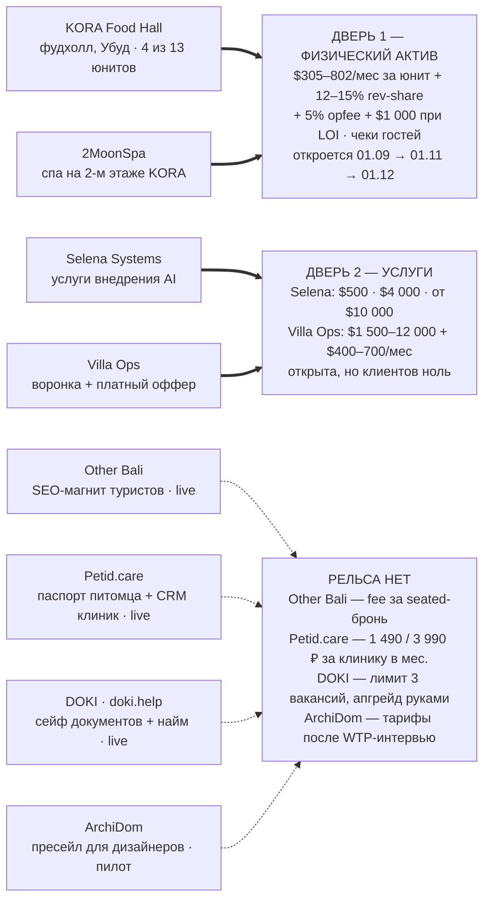

# Revenue Architecture

**Дата разбора:** 4 августа 2026
**Охват:** 8 кодовых баз портфеля Selena Systems
**Метод:** агенты-аналитики по каждому репозиторию, каждое утверждение обязано было опираться на путь к файлу

Кто зарабатывает, кто приводит клиентов, кто удерживает, кто усиливает остальных — по коду, а не по презентациям.

---

## Главный факт: денег не принимает никто

Из восьми продуктов **ни один не имеет работающего платёжного рельса**.

Платёжный код написан только в KORA (Xendit: инвойсы, сплит 12% / 5%, вебхуки, тесты) — но prod-ключей нет, поэтому оплата в проде падает в «заплатите на кассе», а депозиты выключены по умолчанию. У остальных семи — либо прайс на сайте и счёт вручную, либо явно бесплатный пилот по дизайну.

Это не провал, а нормальная стадия: продукты доводили до состояния «есть что продавать». Но отсюда следует главный вывод: **задачи «привести трафик» больше не приоритет**. Трафик уже приводят пять продуктов. Приоритет — открыть двери, через которые деньги физически входят.

| Показатель | Значение |
| --- | --- |
| Продуктов принимают оплату в проде | **0** |
| Двери для выручки | **2** — физический актив и услуги |
| Продуктов с опубликованной ценой или тарифом | **7** |
| Недель до первой реальной кассы (KORA, 01.09) | **4** |

---

## Где деньги входят в компанию

Сплошные стрелки — путь, по которому деньги реально могут дойти сегодня. Пунктир — продукт с объявленной ценой, но без механизма приёма платежа. Четыре продукта из восьми не подключены ни к одной двери.

---

## 1 · Кто зарабатывает

Точнее — кто ближе всех к первым деньгам. Порядок по близости к кассе, а не по размеру рынка.

### KORA Food Hall — реальные контракты

Единственный продукт с подписанными обязательствами и физическим кэшем.

- **Арендаторы:** $35/м²/мес (юниты $305–802/мес) + 12–15% rev-share + 5% операционный сбор + $1 000 невозвратных при LOI + депозит 3 месяца.
- **Гости:** QR-заказы в IDR, меню + 5% сервис + 10% PB1; из платежа KORA удерживает 12% rev-share и 5% opfee сплитом через Xendit.
- Занято **4 из 13** кухонных юнитов (канон 03.07.2026).
- Даты ратифицированы: Test Delivery **01.09**, Soft Opening **01.11**, Grand Opening **01.12**.

> Блокер — отсутствие prod-ключей Xendit: платежи и депозиты выключены за четыре недели до первой кассы.

### Selena Systems — самый быстрый кэш

Услуги внедрения AI. Высокая маржа, нулевая себестоимость рельса.

- Прайс опубликован: **AI Audit $500**, **AI Sprint $4 000**, **AI Business OS от $10 000**.
- Вся конверсия — одна форма лида, уходящая в Telegram-бота основателя или вебхук.
- Бесплатный вход — «AI-карта возможностей» + калькулятор потерь времени.

> Блокер стыдный и дешёвый: без переменных доставки лидов эндпоинт отдаёт `503 LEAD_DELIVERY_NOT_CONFIGURED`, а в `.env.example` они пустые. Плюс на сайте **нулевая аналитика** — диагностическую воронку нечем измерить.

### Villa Ops — 0 клиентов

Платный оффер для управляющих виллами на Бали, живёт на домене родительского бренда.

- Лестница цен: Pilot **$1 500–2 500** · Core **$5 000** · Growth **$7 500–9 500** · Enterprise **от $12 000**; 50% при подписании / 50% при запуске.
- Повторяющаяся выручка: care plan **$400–700/мес** после 14 дней включённой донастройки.
- Оплата вне кода: депозитный инвойс, шаблон Wise/Stripe в USD.

> Продажи заблокированы демо-системой («не начинать аутрич без неё») и нерешённым индонезийским юрлицом: кто подписывает договор, кто выставляет счёт, кому принадлежит IP.

### Разрыв доверия, который дороже любого кода

Selena и Villa Ops продают чеки от $500 до $12 000, при этом правила честности в их же репозиториях запрещают выдуманные кейсы, отзывы и метрики — и правильно запрещают. Значит единственный способ закрыть разрыв — **первые 2–3 клиента со скидкой в обмен на публичный кейс**. Это не маркетинговая задача, а условие открытия второй двери.

---

## 2 · Кто приводит клиентов

Здесь портфель силён — и это самая недооценённая часть компании. Пять продуктов уже работают как машина привлечения, причём два из них приводят клиентов *другим* продуктам.

### Other Bali · live, otherbali.com

- Программатический SEO/AEO: ~80+ маршрутов под запросы, `sitemap`, `robots`, отдельный `llms.txt` для ответных движков.
- Каждый клик «забронировать» уходит в TablePilot с меткой `source=bali_privilege`; первый billable-эвент подтверждён на проде **06.07.2026**.
- Кафе и walk-in монетизировать запрещено намеренно: «это магнит туристов и верх воронки, а не строка выручки».
- Прод-состояние: 89 заведений, 15 районов, 3 маршрута. Денежная часть коверейдж-гейтед — глубоко активен только Чангу.

### Petid.care · live, двусторонняя воронка

Самый умный механизм привлечения в портфеле: бесплатные владельцы приводят платящие клиники.

- Owner-first вход на волне обязательной регистрации животных в РФ: `/pet-pass`, `/registratsiya`, `/poteryashki` (QR потерявшегося питомца).
- Атрибуция первого касания: cookie `pp_src` из UTM с логикой «first touch wins» → `pets.acquisition_source`.
- **Кросс-сторонний рычаг:** форма «пригласить мою клинику» создаёт B2B-лид с `source='owner_referral'`, а напоминания возвращают владельца именно в ту клинику, которая создала событие.
- Фабрика сайтов клиник (`clinic-template` + собственный скилл) — масштабирование B2B-предложения.

### DOKI · doki.help · live, 4 локали

- Программатический SEO в 4 локалях: дедлайн-лендинги (сроки паспорта/визы), сегменты `/for/[segment]`, сравнения `/vs/[slug]` — включая «против Госуслуг, Google Drive, Telegram».
- Привлечение через AI: markdown по content-negotiation, `agents.md`, опубликованный agent-skill.
- Двусторонняя воронка найма: работодатель создаёт вакансию → ссылка `/apply/[slug]` + QR → кандидат подаётся **без регистрации** и потом конвертируется в аккаунт.

### 2MoonSpa · приводит трафик в KORA

Физический кросс-продуктовый рычаг: спа стоит на втором этаже фудхолла.

- SEO-матрица «процедура × интент» + RU/EN блог (~26 и ~25 статей) с Service/FAQ/LocalBusiness разметкой.
- Предзапусковый waitlist с бонусом первым 100 гостям.
- Каждая страница и вся разметка продают связку: сначала процедура, потом «ужин этажом ниже» — двусторонний поток посетителей между двумя объектами Selena.

### Villa Ops как воронка · lead-gen для Selena

- 90-секундный self-assessment из 12 шагов → серверный расчёт Villa Response Readiness Score.
- Гейт разводит поток: команды с портфелем → бесплатный live-аудит, владельцы-одиночки → плейбук в WhatsApp.
- Второй магнит: отдельный «instant website check».

> Лиды уходят в Google Sheet + письмо основателю. Это работает, но это единственное место в компании, где данные о клиентах живут вне системы.

---

## 3 · Кто удерживает

Удержание — самая сильная инженерная часть портфеля и самая слабая коммерческая: механизмы возврата построены качественно, но ни один из них не привязан к оплате.

**Petid.care — эталон удержания**
- Ежедневный cron 06:00: напоминания **D-30 / D-7 / D-1** перед плановой процедурой.
- Дип-линк напоминания ведёт **обратно в клинику**, создавшую событие — удержание владельца и клиники одним действием.
- Прививка с датой ревакцинации сама создаёт следующее напоминание.
- Прогноз запаса корма (триггер повторной покупки), хаб «мои задачи», сейф документов с квотами по тарифу.

**DOKI · doki.help — сейф как переключательные издержки**
- Cron 08:00: напоминания о сроках документов, сотрудников, продлений.
- Документы семьи по людям и активам в приватном бакете.
- Офлайн-доступ к выбранным документам (PWA + IndexedDB).
- Полный жизненный цикл трудоустройства и делегирование доступа родственникам.

**KORA Food Hall — CRM гостя**
- Напоминания за 24 ч и 2 ч до брони через outbox, обрабатываемый cron каждые 5 минут.
- Хранилище гостя: визиты, теги, предпочтения, согласия.
- Сегментированные WhatsApp-кампании с трекингом отправок и RSVP на события.
- Правило депозита против неявок (компания ≥6, приватные форматы) — рассчитывается, но не взимается.

**Other Bali — удержание без логина**
- Сохранённые места и «мой список» на анонимном httpOnly-куке.
- Расшаренные списки `/list/[slug]` возвращают *новых* посетителей.
- QR-редемпшн перка остаётся в профиле гостя как доказательство визита.

**ArchiDom — B2B-липкость**
- Настроенные дизайнером правила цены и шаблоны КП — прямые издержки перехода.
- Хранилище проектов, паспортов, карточек рисков под RLS; студийные места с приглашениями.
- Ответ клиента «Принять / Обсудить / Запросить правки» возвращает дизайнера в продукт.

**2MoonSpa — лунный крючок**
- Живой виджет фазы луны и сценарий «приходите в следующую фазу» — механизм возврата, специфичный для бренда.
- CRM по телефону: число визитов, последний визит, сумма за всё время.
- Уведомление персонала в Telegram на каждую бронь.

---

## 4 · Кто усиливает остальных

Усиление работает не через общий трафик, а через переиспользуемые паттерны, данные и бренд.

1. **Selena Systems — зонтичный бренд и витрина.** Сайт родительского бренда показывает KORA Food Hall, PetID.care, Doki.help, Makeup.cafe, ARHIDOM и ZubiLook как доказательство «operating range». Каждая продажа услуг опирается на продукты, и каждый продукт усиливает продажу услуг. **Это единственный узел, который делает восемь проектов одной компанией.**

2. **Petid.care — фактическое ядро платформы.** Лучшая реализация **14 из 32** общих механизмов (лимиты запросов, согласия, уведомления, i18n, авторизация, напоминания). Плюс фабрика сайтов клиник и задокументированный список того, что у него унаследовал Family Vault.

3. **Other Bali — питает TablePilot и владеет правами на контент.** Отдаёт TablePilot реальные атрибутированные брони. Активы: согласия владельцев на фото с логом, меню с гейтом свежести и источником, сеть отношений с владельцами заведений. Плюс жёсткий контракт `AGENTS.md` — модель дисциплины для остальных репозиториев.

4. **KORA — модель управления решениями.** Реестр `DECISIONS.md` (§29, ~171 КБ), линтер запрещённых слов бренда, QA-гейты в CI, скилл слежения за конкурентами. Плюс проприетарная база 64 операторов Bali F&B.

5. **ArchiDom — комплаенс-паттерн для русского рынка.** Абстракция LLM-провайдера с единственной точкой входа и маскирование персональных данных до вызова модели (проверено тестами: город и контакты в промпт не уходят).

6. **DOKI — донор механики токенов.** Стек расшаренных ссылок (срок, отзыв, пароль, журнал просмотров) уже переиспользован: миграция в Petid ссылается на него дословно. Плюс общая продакшн-база с Doki.id.

7. **2MoonSpa — SEO-фабрика и физическая связка.** Кластеры ключей плюс кодифицированный скилл генерации страниц. И единственная **физическая** синергия: два объекта Selena в одном здании.

---

## Сводная матрица ролей

| Продукт | Зарабатывает | Приводит | Удерживает | Усиливает | Первая реальная выручка |
| --- | --- | --- | --- | --- | --- |
| KORA Food Hall | сильно | — | сильно | средне | 01.09.2026 (Test Delivery) |
| Selena Systems | сильно | средне | — | **ключевой узел** | возможна в этом месяце |
| Villa Ops | средне | сильно | — | средне | после демо + юрлица |
| 2MoonSpa | средне | сильно | средне | средне | ~01.09.2026 (открытие) |
| Other Bali | — | **сильно** | сильно | сильно | не раньше конца free-периода |
| Petid.care | — | сильно | **сильно** | **сильно** | после валидации спроса |
| DOKI · doki.help | — | сильно | сильно | средне | после решения по 152-ФЗ |
| ArchiDom | — | средне | средне | средне | после WTP-интервью |

«Сильно» означает, что механизм реализован в коде и подтверждён путями к файлам, а не заявлен в документации. Пустая клетка — механизма нет, а не «плохо сделан».

---

## Три вывода, которые меняют приоритеты

**Вывод 1. Единственная дверь, которая откроется в этом квартале — физическая.**
KORA и 2MoonSpa имеют жёсткие даты: **01.09**, **01.11**, **01.12**. Это не гипотеза о конверсии, а календарь с подписанными арендаторами. Всё, что не приближает эти даты, конкурирует с ними за время — и проигрывает.

**Вывод 2. Самый быстрый доход заблокирован задачей на пятнадцать минут.**
Selena Systems продаёт пакеты по $500–$10 000, а её эндпоинт лидов отдаёт `503`, пока не заданы переменные доставки. Villa Ops не может продавать, пока не решён вопрос юрлица. Ни то, ни другое — не инженерная задача. **Из 24 зафиксированных блокеров по всем восьми продуктам только пять требуют написания кода**; остальные — ключи, домены, SMTP, юрлица, аккаунты сторов и юридические решения.

**Вывод 3. Потребительские продукты — это машина удержания без монетизации.**
Other Bali, Petid.care, DOKI и ArchiDom вместе дают лучшую в портфеле верхнюю воронку и лучшие механизмы возврата — и ни одного способа заплатить. Это осознанные решения, и они верны на стадии валидации. Но их нельзя «докрутить трафиком»: пока нет рельса, рост числа пользователей увеличивает только затраты. Правильный следующий шаг для них — не рост, а **подтверждение готовности платить** у одного сегмента.

---

## Границы достоверности

Проверочный проход независимыми агентами прошёл для **Other Bali, Petid.care и DOKI**. Для ArchiDom, KORA, 2MoonSpa, Villa Ops и Selena Systems верификаторы упали по лимиту доступа — их данные приведены в исходном виде и требуют выборочной перепроверки. Числа по срокам и ценам взяты из репозиториев на 4 августа 2026.

**Портфель шире восьми репозиториев.** В коде и данных упоминаются TablePilot, Doki.id, Makeup.cafe и ZubiLook — их репозиториев в этом разборе не было. TablePilot особенно важен: он получает выручку от броней Other Bali, но его экономика здесь не оценивалась.
